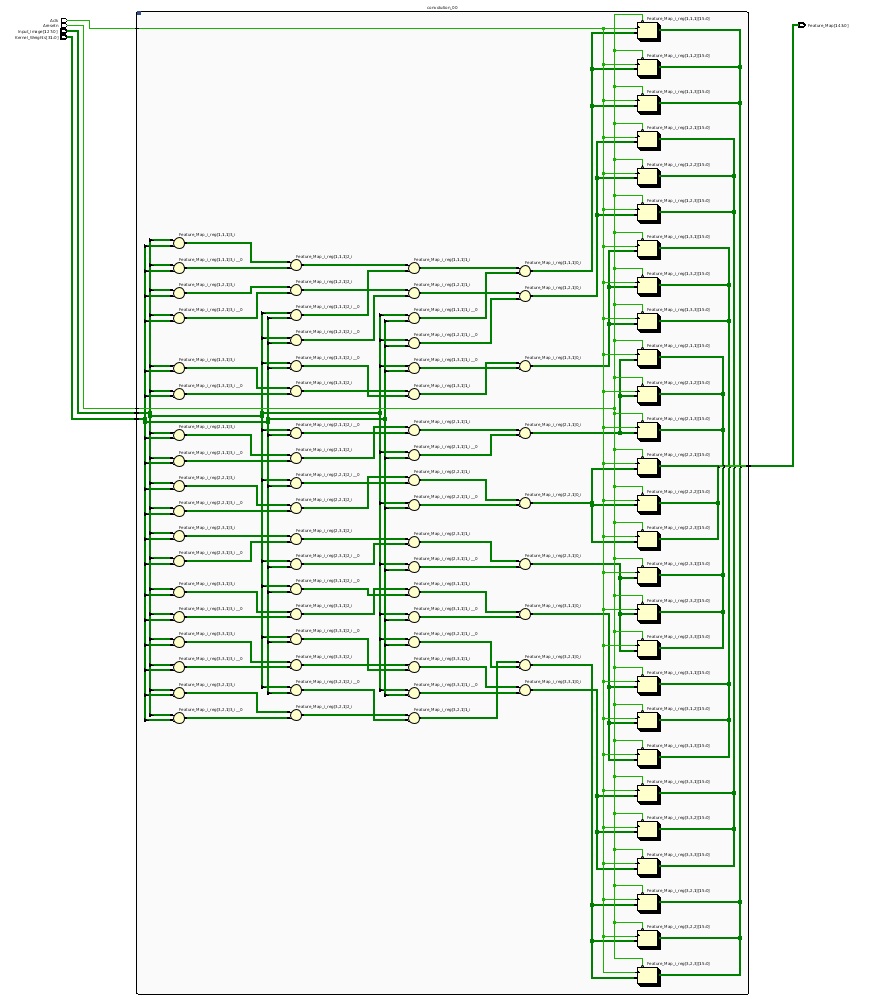

*************************************
CNN Inference on FPGAs Project Report
*************************************

Introduction
============

Machine learning (ML) has drastically increased in popularity over the past decade due to technilogical advancements in available processing power. Although concepts of ML and, more specifically, deep neural networks (DNN) are not exactly new ideas, it has only been in the last decade or so that these techniques have become practical solutions for real-world problems. A large number of tools have been developed and made available by various organizations that provide an accessible framework for the design of neural networks (NN) such as TensorFlow, Caffe, and PyTorch. These frameworks provide the tools needed in order to quickly implement NNs on both central processing units (CPU) and graphics processing units (GPU). As of late, GPUs have been the goto processing resource for implementing DNN models and algorithms due to the large array of processing cores it provides. Modern-day GPUs can have thousands of processing cores to enable massive parallelization of single instruction multiple data (SIMD) type calculations. 

Although GPUs have been greatly beneficial for the advancement of DNN performance, there are a few drawbacks. High performing GPUs consume large amounts of energy and are thus particularily limited in mobile and other low-power applications. In addition, the development of NNs on GPUs requires the use of an application programming interface (API) which provides access to parallel processing capabilites for general purpose use cases. This extra layer of abstraction from the hardware reduces the maximum achievable hardware efficiency and increases energy consumption. As for the APIs available, NVIDIA's CUDA platform provides developers with a comprehensive library for NN support on NVIDIA GPUs. NVIDIA's active development in the CUDA framework and its features will no doubt make improvements on performance and efficiency. Due to the static nature of a GPU's architecture, however, there exists a fundamental limitation to the achievable utilization of hardware and its efficiency.

This leads in to the purpose of this project which is to explore the topic of neural network inference using field-programmable gate arrays (FPGA). Unlike GPUs, FPGAs are dynamically configured at a much lower hardware level for the purpose of accelerating specific tasks with unparalleled time-determinism. FPGAs can be quickly reconfigured for changes in application. A relatively new concept called partial reconfiguration has also been introduced which provides the developer with the ability to reconfigure specific regions while the rest of the device is able to continue in normal operation. Application specific acceleration engines can be conveniently described using behavioral HDL while concurrently allowing the developer to closely manage synthesis at the register transfer level (RTL) if needed.

The primary application of NN models in this project will be for image recognition and will focus primarily on the inference of convolutional neural networks (CNN). The first part of this report will summarize the current state of research and the advancements that have been made for FPGA inference. The project also seeks to determine whether FPGAs have potential to compete as an effective alternative to GPUs and for what use cases those might be. Metrics of evaluation include cost, peak performance capability, energy efficiency (or performance density), and additional advantageous features such as adaptability. The report will break down the various components used in a typical CNN model and describe how they are implemented in programmable logic (PL). These functional blocks include units for convolution, fully connected (FC) layers, pooling operations, and non-linear activation units. Outside of the NN itself there will be additional PL infrastructure that may include a direct memory access (DMA) engine, a state-machine or control unit (CU), as well as a memory-mapped interface to the processing system (PS). Additional supporting components may be added depending on the architecture framework used for implementing the model.

Due to the modular nature of a NN with its independently functioning components, people quickly theorized and implemented generic constructs that can scale in size, be re-ordered, or even be swapped out for other modules. Hardware description language (HDL) designs take in parameters pre-synthesis and uses them to define compatible interfaces and to implement desired functionality for specific implementations. There already exists a number of tools capable of auto-generating HDL for realizing NN models in PL. Some tools require the user to describe the model in a abstracted high level language while others don't require any programming at all. This is important since the majority of software developers and scientists seeking to apply ML in their work are not experienced with HDL design. In addition, describing a NN from scratch using HDL could be an arduous process especially if the designer does not have the experience to capitalize on generic component designs and the potential for modularity it would provides. The development of accessible toolflows and libraries is an important step forward in reducing the barrier to entry for FPGA use in ML applications. We will briefly explore the various toolflows currently available that provide auto-generation of synthesizable code for building CNN models.

Components
==========

Convolutional Block
-------------------

In order to understand the interface of a convolutional block used for image classification, we must first understand the image format. A colored image consist of a grid of pixels where each pixel has three associated intensity values one for red, one for green, and one for blue (RGB). Thus we we describe colored images as having three channels. Typically these color values will have 8-bit precision per color providing 256 levels of intensity. For example, a small 10x10 RGB image will have 100 pixels and will consist of 300 bytes. The input description for the first convolution operation using the example can be described as a 10x10x3 three-dimensional grid of 8-bit values.

The convolution operation consists primarily of the multiply-accumulate (MAC) operation. The trained weights of a CNN are realized using what is called a "kernel" which is just a square grid of trained weight values, smaller in dimension than the input image. It is important to note that when working with 3-channel RGB images, a unique kernel grid must exist for each color-channel resulting in a 3-dimensional MxNx3 shaped kernel. This grid of weights functions as a sliding filter that moves over the image where in each iteration it is convolved with an equally sized sub-section of the input image. For each iterative location of the kernel, the image grid and kernel grid are multiplied element-wise. The resulting product from each pixel/weight multiplication is then summed together respective of their color-channel to produce a scaler output. In a model for RGB images there will be three scaler values that orrespond to that iteration of the applied kernel location. For the next iteration the kernel is shifted over the image by one pixel such that it covers a slightly different portion of the input image. This process is repeated until all rows and columns of the image's grid-space have been covered. The scaler outputs are then organized together to form a new grid of values called the "feature map". This feature map is then passed forward to the next operation in the network. Described above is the most basic form of the convolution operation in which row and column grid dimension of the resulting feature map can be individually calculated as (IMAGE_LENGTH - KERNEL_LENGTH + 1). There are additional features that are commonly used in convolutional blocks that can typically be activated and adjusted by setting parameters. In some situations it may be desirable to apply zero-padding to the convolution operation by surounding the input image borders with zero-valued pixels. Applying zero-padding of size one will increase the input dimensions of the image by two in both dimension (exe. 6x6 grid becomes 8x8). Another common parameter used in convolution operations is stride length which by default is typically set to a value of one. Stride length controls the number of pixels in which the kernel will shift over the input image after each iteration. By default it is typically set as one but can be increased to effectively downsample and thus reduce the size of the output feature map.

Implementing a convolution function in hardware is computationally expensive and will require a fair amount of processing resources. Convolution operations will typically consume the majority of the total utilized processing resources when working with CNNs. It would seem intuitive then that the convolution operations will occupy the majority of the utilized logic resources when implementing a CNN in an FPGA. 

Break down conv fpga implementation design and resource usage. How are kernel weights loaded?

Notice that convolutional blocks used in NN designs are for the most part all very similar if not identical. The only differences would be parameters such as input and kernel size as well as other settings such as zero padding widths and stride size. These blocks have a high potential for modularity. A generic convolution block can be described in HDL once and then instantiated as many times as needed. By using generic inputs during instantiation, block parameters are determined pre-synthesis allowing for different types of convolutional layers to be implemented throughout the model. By creating these generic operation blocks we can start to imagine simplified and abstracted methods for assembling NNs on an FPGA. Creating a model in programmable logic purely through hand written HDL would be arduous and repetative. Such a large portion of the physical design can be collapsed down into generic logical pieces, reducing the number of lines of HDL code and also reducing the time spent copying/pasting and reordering code slices for new iterations of the model design. This DNN attribute of having a few basic building blocks that assemble together with different parameters in various configurations provides huge advantages in facilitating efficient design iterations. This is important since the majority of scientists and engineers that want to incorporate ML in their work do not have a strong programmable logic background or experience coding HDL. The involved process and complex nature of FPGA/SoC design - apparent to those seeking out programmable logic solutions for ML applications - proves to be a significant barrier to entry. I speculate that it is partly for this reason that FPGAs are not the common choice for DNN solutions. However, because of the high degree of DNN modularity discussed, this market pattern could soon change. A surprisingly large number of frameworks have already been developed - mostly through university research - that provide users with accesible design frameworks for CNN implementations on PL without requiring custom handwritten HDL. These frameworks harness the inherent modularity of CNN blocks to provide users with the capability of auto-generating a complete HDL description that implements their desired model. The developer interface varies among the available frameworks but most frequently resorts to a high-level synthesis language approach. Frameworks such as HADDOC2 and DnnWeaver provide compatibility with models that have been developed with Caffe which is a very popular DNN framework with a python interface. By addapting a framework that is already familiar in the deep learning (DL) community, these new tools are opening the doors for DNN inference on FPGAs to a much broader spectrum of potential developers. 

Talk about the use of modularity. Instantiations of a generic convolutional block. How this can be used for auto-generation of HDL to describe a CNN.

Discuss the proposed implementation architectures in other papers

.. code-block:: VHDL

  library IEEE;
  use IEEE.STD_LOGIC_1164.ALL;
  use IEEE.NUMERIC_STD.ALL;
  library xil_defaultlib;
  use xil_defaultlib.mypackage.ALL;

  entity convolution is
      Generic(
          IMAGE_SIZE      : natural := 6;
          KERNEL_SIZE     : natural := 3;
          CHANNEL_COUNT   : natural := 3
      );
      Port (  
          Aclk            : in std_logic;
          Aresetn         : in std_logic;
          Input_Image     : in 
              GridType(1 to IMAGE_SIZE, 1 to IMAGE_SIZE, 1 to CHANNEL_COUNT)(7 downto 0);
          Kernel_Weights  : in 
              GridType(1 to KERNEL_SIZE, 1 to KERNEL_SIZE, 1 to CHANNEL_COUNT)(7 downto 0);
          Feature_Map     : out 
              GridType(1 to (IMAGE_SIZE-KERNEL_SIZE+1), 1 to (IMAGE_SIZE-KERNEL_SIZE+1), 1 to CHANNEL_COUNT)(15 downto 0)
      );
  end convolution;

  architecture Behavioral of convolution is
  begin

      process(Aclk, Aresetn)
          variable var_feature 
              : GridType(Feature_Map'range(1), Feature_Map'range(2), Feature_Map'range(3))(15 downto 0);
      begin
          var_feature := (others => (others => (others => (others => '0'))));
          if Aresetn = '0' then
              Feature_Map <= (others => (others => (others => (others => '0'))));
          elsif rising_edge(Aclk) then
              for row_iter in Feature_Map'range(1) loop
                  for col_iter in Feature_Map'range(2) loop
                      for row in Kernel_Weights'range(1) loop
                          for column in Kernel_Weights'range(2) loop
                              for channel in 1 to CHANNEL_COUNT loop
                                  var_feature(row_iter, col_iter, channel) := (
                                      var_feature(row_iter, col_iter, channel) + (
                                          Input_Image(row + row_iter - 1, column + col_iter - 1, channel) * 
                                          Kernel_Weights(row, column, channel)
                                      )
                                  );
                              end loop;
                          end loop;
                      end loop;
                  end loop;
              end loop;
              Feature_Map <= var_feature;
          end if;
      end process;

  end Behavioral;

   Elaborated design of convolution.vhd (Image Size: 4x4, Kernel Size: 2x2, Color Channels: 3)

Pooling Block
-------------

Pooling layers are useful in CNN designs because they limit computational complexity while functioning to prevent overfitting. Pooling can be thought of as a process of down-sampling the feature map at the output of a convolutional layer. There are a number of different pooling functions that are used in CNN designs. Two very common common functions are average-pooling and max-pooling. As the name suggests, the pooling function moves across the range of the feature map and consolidates individual sections down to a single value. A typical example of a pooling operation is a 2x2 block that converts a four element section and reduces it to a single max or averaged value output. A 2x2 block that iterates over an 8x8 feature map without overlaps would effectively downsample the feature map to produce a 4x4 output thus cutting its dimensions in half [7].

Non-Linear Activation Block
---------------------------

The non-linear block implements an activation function for the primary purpose of introducing non-linearity to the CNN model. If a NN is not capable of utilizing non-linear properties then it will only be successful at modeling against a very basic set of data. The activation function is what unlocks the model's ability to train against the complex attributes we observe in the world around us. One of the most common and also perhaps the most simple of the available activation functions is the rectified linear unit, more simply referred to as the ReLU operator. There are a few adaptions of the ReLU operator being used today, but the most basic form of the rectified linear unit simply converts all negative inputs to zeros while leaving postive values unchanged.

Fully Connected Block
---------------------

The fully connected (FC) layer of a CNN is primarily used for classification at the final stage of the network model. Multiple FC layers can, however, be implemented throughout the model as hidden layers but will typically reside in the final few stages of the network. The number of neurons used in each layer can be adjusted during the design phase for optimizing performance. It is important to note though that the number of possible image classifications will determine the output size of the final FC layer. That is because each classification label will be assigned to an output neuron and whichever neuron is most favored will be used as the network prediction.

Architecture
============

Single Engine vs Streaming architectures [4]

FPGA vs. GPU
============

Techniques for Efficient Implementations
========================================

Data Quantization

Loop Unrolling

Time Multiplexing

Weight Reduction (SVD)

Available Toolflows
===================

Custom Design and Implementation
================================

Performance Evaluation
======================

Direction of Future Work
========================

Conclusion
==========
