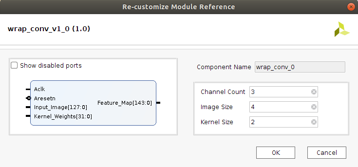
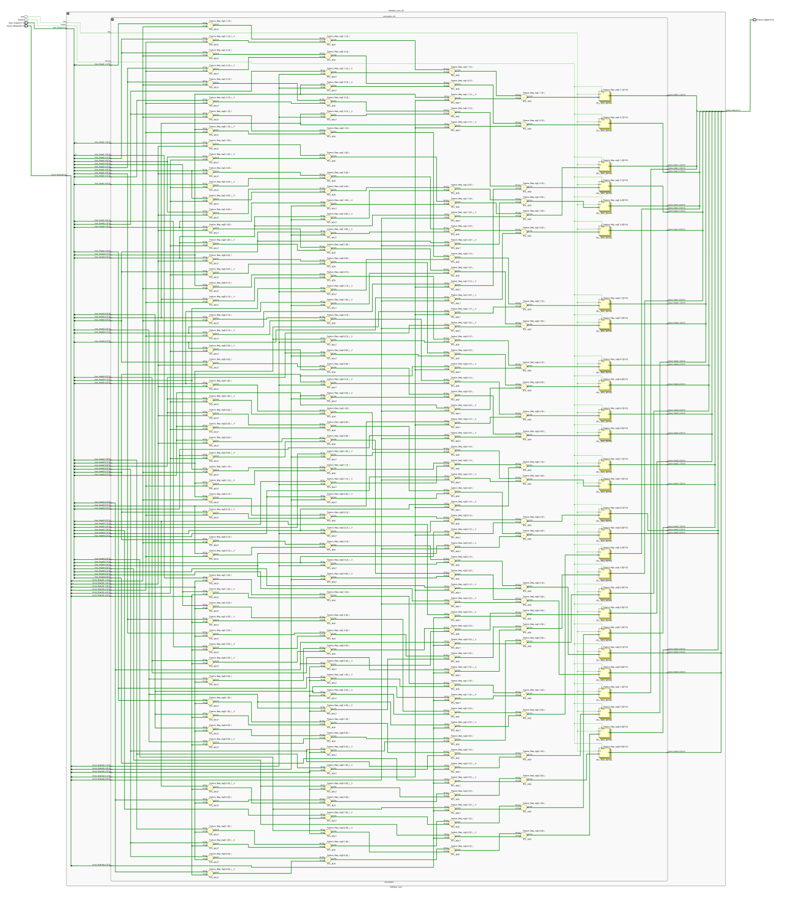

**(preliminary draft)**

**************************************
CNN Inference on FPGAs: Project Report
**************************************

Introduction
============

Machine learning (ML) has drastically increased in popularity over the past decade due to technological advancements in processing power. Although concepts of ML and, more specifically, deep learning (DL) are not exactly new ideas, it has only been in recent years that these techniques have become practical solutions for many real-world problems. A large number of tools have been developed and made available by various groups that provide an accessible framework for the design of neural networks (NN). These include TensorFlow, Caffe, and PyTorch to name a few. These frameworks provide the tools needed in order to quickly implement NNs on both central processing units (CPU) and graphics processing units (GPU) with only minimal experience. As of late, GPUs have become the goto processing resource for implementing deep neural network (DNN) models due to the large array of processing cores it provides. Modern-day GPUs can have thousands of processing cores to enable massive parallelization of single instruction multiple data (SIMD) type calculations. Field programmable gate arrays (FPGAs) provide yet another solution for executing massively parallelized calculations while additionally providing a comprehensive set of additional capabilities and features.

The purpose of this project is to explore the topic of neural network inference using FPGAs. Unlike GPUs, FPGAs are dynamically configured at a lower hardware level and can be used for the purpose of accelerating specific tasks with unparalleled time-determinism. FPGAs can also be quickly reconfigured for changes in application. A relatively new concept called partial reconfiguration has also been introduced and provides the developer with the ability to reconfigure specified regions at runtime while the rest of the device continues in normal operation. Application specific acceleration engines can be intuitively described using behavioral HDL code while concurrently allowing the developer to closely manage synthesis at the register transfer level (RTL) if needed.

The primary application of NN models in this project will be for image recognition and will focus primarily on the inference of convolutional neural networks (CNN). The first part of this report will summarize the current state of research and the advancements that have been made for FPGA inference. The project also seeks to determine whether FPGAs have potential to compete as an effective alternative to GPUs as well as to determine the characteristics of an effective use case. Metrics of evaluation include cost, peak performance capability, energy efficiency, performance density, as well as other capabilities such as adaptability. The report will break down the various components used in a typical CNN model and describe how they can be implemented in programmable logic (PL). These functional blocks include units for convolution, fully connected (FC) layers, pooling operations, and non-linear activation functions. Outside of the NN itself there will be additional PL infrastructure that may include direct memory access (DMA) cores, a state-machine or control unit (CU), as well as a memory-mapped interface to the processing system (PS). Additional supporting components may be included depending on the architectures used for implementing the model.

Components
==========

Convolutional Block
-------------------

In order to understand the interface of a convolutional block used in image classification, we must first understand the format of an input image. An RGB color image consist of a grid of pixels where each pixel has three associated intensity values for red, green, and blue. We therefore describe RGB images as having three channels. Typically these color values will have 8-bit precision per color to provide 256 levels of intensity. For example, a 32x32 RGB image will have 1024 pixels and will consist of 3072 bytes. The input description for the first convolution operation using the example can be described as a 32x32x3 three-dimensional grid of 8-bit values.

The convolution operation consists primarily of the multiply-accumulate (MAC) operation. The trained weights of a CNN are realized using what is called a "kernel" which is just a square grid of trained weight values that is smaller in dimension than the input image. It is important to note that when working with 3-channel RGB images, a unique kernel grid must exist for each color-channel resulting in a 3-dimensional MxNx3 shaped kernel. This grid of weights functions as a sliding filter that moves over the image where in each iteration it is convolved with an equally sized sub-section of the input image. For each iterative location of the kernel, the image grid and kernel grid are multiplied element-wise. The resulting product from each pixel-weight multiplication is then summed together respective of their color-channel to produce a scalar output. In a model for RGB images there will be three scalar values that correspond to each iteration of the applied kernel location. For the next iteration the kernel is shifted over the image by one pixel such that it covers a slightly different portion of the input. This process is repeated until all rows and columns of the image's grid-space have been convolved. The scalar outputs are then organized respectively to form a new grid of values called the "feature map". This feature map is then passed forward to the next operation in the network. Described above is the most basic form of the convolution operation. There are additional features that are commonly used in convolutional blocks that can typically be activated and adjusted by selecting parameters. In some situations it may be desirable to apply zero-padding to the convolution operation by surrounding the input image borders with zero-valued pixels. Applying zero-padding of size one will increase the input dimensions of the image by two in both vertical and horizontal dimensions (example: 6x6 grid becomes 8x8). Another common parameter used in convolution operations is stride length which typically by default is set to one. Stride length controls the number of pixels in which the kernel will shift over the image for each iteration. Stride length can be increased to effectively downsample and thus reduce the size of the output feature map.

Implementing a convolution function in hardware is computationally expensive and will require a fair amount of processing resources. Convolution operations will typically consume the majority of the total utilized processing resources in CNN models. Intuitively, the convolution operations will occupy the majority of the utilized logic resources when implementing CNNs on FPGAs. 

Notice that convolutional blocks used in NN designs are for the most part all very similar if not identical. The only differences would be parameters such as input and kernel size as well as other settings such as zero padding widths and stride size. These blocks have a high potential for modularity. A generic convolution block can be described in HDL once and then instantiated as many times as needed. By using generic inputs during instantiation, block parameters are determined pre-synthesis allowing for different types of convolutional layers to be implemented throughout the model. 

Pooling Block
-------------

Pooling layers are useful in CNN designs because they limit computational complexity while functioning to prevent over-fitting. Pooling can be thought of as a process of down-sampling the feature map at the output of a convolutional layer. There are a number of different pooling functions that are used in CNN designs. Two very common common functions are average-pooling and max-pooling. As the name suggests, the pooling function moves across the range of the feature map and consolidates individual sections down to a single value. A typical example of a pooling operation is a 2x2 block that converts a four element section and reduces it to a single max or averaged value output. A 2x2 block that iterates over an 8x8 feature map without overlaps would effectively downsample the feature map to produce a 4x4 output thus cutting its dimensions in half [7].

Non-Linear Activation Block
---------------------------

The non-linear block implements an activation function for the primary purpose of introducing non-linearity to the CNN model. If a NN is not capable of utilizing non-linear properties then it will only be successful at modeling against a very basic set of data. The activation function is what unlocks the model's ability to train against the complex attributes we observe in the world around us. One of the most common and also perhaps the most simple of the available activation functions is the rectified linear unit, more simply referred to as the ReLU operator. There are a few adaptions of the ReLU operator being used today, but the most basic form of the rectified linear unit simply converts all negative inputs to zeros while leaving postive values unchanged.

Fully Connected Block
---------------------

The fully connected (FC) layer of a CNN is primarily used at the final stage of the network model and serves to transform feature maps into the final image classifications. Multiple FC layers can exist throughout the model as hidden layers. It is most common, however, for them to be instantiated in sequence of decreasing size at the end. The number of neurons used in each hidden layer can be adjusted during the design phase for optimizing performance. It is important to note though that the number of possible image classifications will determine the number of neurons in the final FC layer. Each classification label will be assigned to an output neuron and whichever neuron is most favored will be used as the network's prediction. As the name suggests, FC layers require that each neuron be connected to all the neurons of neighboring FC layers making them particularly resource costly. Each neuron requires a trained bias value as well as trained weights for each neuron in the following layer. This means a large overhead of trained values must be stored and made available to the model.

Architecture
============

By creating generic operational blocks we can start to imagine simplified and abstracted methods for assembling NNs on an FPGA. Creating a model in programmable logic purely through hand written HDL would be arduous and repetitive. Such a large portion of the physical design can be collapsed down into generic logical pieces, reducing the number of lines of HDL code and also reducing the time spent copying/pasting and reordering code slices for new iterations of the model design. This DNN attribute of having a few basic building blocks that assemble together with different parameters in various configurations provides huge advantages in facilitating efficient design iterations. This is important since the majority of scientists and engineers that want to incorporate ML in their work do not have a strong programmable logic background or experience coding HDL. The involved process and complex nature of FPGA/SoC design - apparent to those seeking out programmable logic solutions for ML applications - proves to be a significant barrier to entry. I speculate that it is partly for this reason that FPGAs are not the common choice for DNN solutions. However, because of the high degree of DNN modularity discussed, this market pattern could soon change. 

Two broad categories of CNN architectures as stated in [Toolflows] include the streaming accelerator architecture and the single engine architecture. 

**Streaming accelerator architectures** are characterized as having each of its layers individually instantiated in logic with parameters optimized for a specific model. Each layer will have data streaming out to the following operation while data from the preceeding stage will flow in. This happens for all layers concurrently such that utilization of the implemented resources is maximized. An advantage of the streaming approach is that feature data between operations does not require the use of off-chip memory access. This alleviates memory bandwidth while improving the achievable classification latency. 

.. figure:: figs/streaming_architecture.png

   Figure: Streaming Architecture Example

**Single engine architectures**, as the name implies, take the form of a single powerful accelerated computation engine capable of executing each layer of the CNN model sequentially. This type of implementation can take on many variations but typically requires a control unit or finite-state machine (FSM) that moderates data-flow and schedules sequences of operation. The single engine will consist of an array of processing elements that support SIMD matrix operations for completing convolutions, non-linear functions, pooling and other required operations all in a single engine. One huge advantage of this approach is the potential for a single FPGA design to operate on many different model configurations and data sets without the need for re-programming. This allows for increased flexibility but at the cost of reduced resource utilization efficiency as well as consistency of performance results. Although simple models could get by with only on-chip memory (OCM) use, complex models will require significantly more access to off-chip memeory than a comparable streaming architecture. 

.. figure:: figs/single_engine_architecture.png

   Figure: Single-Engine Architecture Example

* Static vs. dynamic scheduling
* ...

FPGA vs. GPU
============

Although GPUs have been greatly beneficial for the advancement of DNN performance, there are a few drawbacks. High performing GPUs consume large amounts of energy and are thus particularly limited in mobile and other low-power applications. In addition, the development of NNs on GPUs requires the use of an application programming interface (API) which provides access to parallel processing capabilities for general purpose use cases. This extra layer of abstraction from the hardware reduces the maximum achievable hardware efficiency and increases energy consumption. As for the APIs available, NVIDIA's CUDA platform provides developers with a comprehensive library for NN support on NVIDIA GPUs. NVIDIA's active development in the CUDA framework and its features will no doubt make improvements on performance and efficiency. Due to the static nature of a GPU's architecture, however, there exists a fundamental limitation to the achievable utilization of hardware and its efficiency.

* ...

Techniques for Efficient Implementations
========================================

**Data Quantization** is a technique that can provide a significant reduction in the required computation and memory resources as well as memory bandwidth. The extreme flexibility provided by FPGAs allows for customizing the data type and size to fit the application. CPUs and GPUs are designed with pre-determined precision. This means that on a 32-bit GPU, a small value operation that requires only 8-bit precision would still consume the full 32-bit operation resource. This inefficiency can be uniquely solved with the FPGA's ability to configure computation resouces using only the level of precision required. Many applications exist where high resolution computations do not provide measurable improvements in overall NN performance. In such cases, models can be implemented in FPGAs with reduced precision to provide benefits such as reduced power consumption, increased throughput, or additional resource and memory capacity for other operations. Take for example a model that inputs RGB images with 8-bit resolution per color channel. Using quantization, the 8-bit channel resolutions can be reduced down to 4-bits or even 2-bits to significantly reduce resource utilization. Alternatively, quantization could be applied to other image dimensions by reducing the pixel count or even through monochromatic conversion. In all cases, kernel weight parameters should be adjusted accordingly. Classification accuracy can be tested for each configuration to observe any degradation in performance.

We evaluate the benefits of data quantization using an implementation of a fully unrolled convolution block; the design of this block is discussed later in the report. The convolution block was configured for single channel 3x3 inputs using 1-bit zero-padding and a 3x3 kernel to produce an output 3x3 feature map. Channel resolutions for both the image and kernel weights were adjusted for three seperate implementation runs. Resulting resource utilization is shown in the table below.

+------------+------+------------------+-----------+-------------+
| Resolution | LUTs | LUT %            | Registers | Registers % |
+============+======+==================+===========+=============+
| 8-bit      | 3974 | Reference (100%) | 144       | 100%        |
+------------+------+------------------+-----------+-------------+
| 4-bit      | 1073 | 27%              | 72        | 50%         |
+------------+------+------------------+-----------+-------------+
| 2-bit      | 267  | 6.7%             | 36        | 25%         |
+------------+------+------------------+-----------+-------------+

The results of this test show significant savings in computation resource usage. Reducing bit-width from 8-bit to 4-bit provided a 73% reduction in LUTs and a 50% reduction in registers. Further quantization to 2-bit values provided a total of 93.3% reduction in LUTs and a 75% reduction in registers. It is evident that tremendous resource savings can be achieved using data quantization techniques. However, classification accuracy will need to be evaluated for the specific application to determine whether quantization is a viable option.

**Binerized Neural Networks (BNN)** take data quantization to the extreme by reducing bit-widths to the minimum necessary. Fully binarized networks use single-bit values for both input and output activations as well for weights. FPGAs are especially well suited for optimizing these custom-type implementations given their ability to configure logic to use only the precision required. This means that common CNN operations such as convolution - requiring many MAC operations - become much less expensive. FINN is an open-source BNN tool developed by Xilinx Research Labs [ref] that is capable of implementing both fully-binarized and partially-binarized neural networks. Given the extreme level of quantization and resource savings, results have demonstrated impressive classification accuracy. More impressive, however, is the extremely high throughput and low latency that can be realized (see table). Their results demonstrate the potential efficiency of BNNs on FPGAs but also highlights some limitations of classification accuracy achieved when using large image models.

+----------+----------------------------+---------+----------+
| Dataset  | Throughput (Images/Second) | Latency | Accuracy |
+==========+============================+=========+==========+
| MNIST    | 12.3 million               | 0.31 us | 95.8%    |
+----------+----------------------------+---------+----------+
| CIFAR-10 | 21,906                     | 283 us  | 80.1%    |
+----------+----------------------------+---------+----------+

The following summary describes the techniques FINN uses to implement a highly efficient BNN. First is the popcount accumulator which serves as the dot product summation operation. All synapses coming into a neuron are single-bit values and can be stored as an array. The popcount operation simply adds up all the set bits in this array and outputs the sum. Popcount provides a 50% reduction in resource usage in comparison to the alternative signed accumulator. A thresholding unit is then applied to this sum and will serve as a simple binary implementation of the Batchnorm-activation function. The threshold value and polarity is constant and can be determined from the trained weights of a full batchnorm-activation process used during training.

.. math::
	
	\[
		Learned weights: \Theta_k = (\lambda_k, \mu_k, \i_k, B_k)
		BatchNorm(a_k, \Theta_k) = \lambda_k (a_k - \mu_k) i_k + B_k
		BatchNorm(a_k, \Theta_k) = 0 -> \Tau_k = mu_k - \frac{B_k}{\lambda_k i_k}
		Threshold: \Tau_k^+ = \frac{|Tau_k + S_{Fan-In}}{2}
	\]

Using this training-weight derived, positive-only, threshold value, we can now apply an unsigned comparator on the sum and the threshold, obtaining a binary output. Thus, a simple comparator and a compile-time initialized constant can realize a binary batchnorm-activation using less than just 5% of the resources that would otherwise have been required. Lastly, FINN uses the simple logical OR operator to apply the max-pooling function on the results of the comparators. FINN shows that the vast majority of computations in a BNN can be synthesized down to nothing more than popcounters, comparators, and OR-gates. The paper goes on to describe the organizational architecture of their BNN which includes aggregating these operations into what they call matrix-vector-threshold units (MVTU). 

**Loop Unrolling** is a technique that has potential to both decrease a model's latency as well as increase its throughput capacity. Loop unrolling is what allows a design to capitalize on what FPGAs have been known to excel at. That is, parallel processing. As previously discussed, CNN models are primarily composed of SIMD type operations where a benefit can be realized by instantiating many processing elements - such as MACs - in parallel. This is possible because convolution operations do not require an extensive number of calculations that need to execute in a specific sequence. In other words, the output of one MAC operation in a convolutional layer does not need to be made available to another MAC in that same layer. As is demonstrated later in this report, each of the popular CNN layers (convolution, activation, pooling...etc) can theoretically be executed in just a single clock cycle. Although the idea of classifying millions of images every second is exciting, there are two primary restraints when attempting to unroll a model. First is the apparent limitation of available logic resources on an FPGA. A fully unrolled layer such as convolution could easily consume the resources of an entire logic device, depending on the device and the dimensions of the image. The second restraint is timing closure. A large convolution kernel will require the summation of many multiplier products. All these multiply and adder circuits will need to resolve before the arrival of the following clock edge which will lock the final result into a register. If the propogation delays are too long or the clock is too fast, an implementated design will fail timing analysis meaning that the clock could register erroneous data.

**Folding** (otherwise known as time-multiplexing) has the opposite effect of loop unrolling. It is the sharing of a computational resource among multiple operations that are executed during different time intervals. This technique can be used to optimize resource utilization when certain processes are not required to run all the time. For exmaple, let us say that every 50 clock cycles operation A generates a result which is used as an input to operation B. Once operation B consumes that result it takes only 10 clocks to finish its calculation and then waits for the next result from A. This means that the composition of resources for operation B are not utilized 80% of the time and is thus not optimal. In this situation, loop unrolling operation B will not benefit the system but will instead consume under-utilized resources. If possible, it would be beneficial to construct the model such that the computation resources of operation B are shared over time partitions with other operations in the model. Time-multiplexing fully-utilized resources will of course increase overall system latency and decrease throughput. This may be required for larger designs or when constrained to smaller FPGA devices. Together, loop unrolling and folding can be used to balance a system's performance and optimize efficiency, utlimately maximizing capability.

Post-Synthesis Convolution Utilization with and without Folding (Git hash: d273698)

* Image Size: 	10x10
* Channels: 	1
* Resolution: 	8-bit
* Stride: 		1
* Padding: 		0

+-----------------+-----------+------------------+-----------------+
| Site Type       | Available | Used w/o Folding | Used w/ Folding |
+=================+===========+==================+=================+
| Slice LUTs      | 17600     | 45121 (256.37%)  | 1950 (11.08%)   |
+-----------------+-----------+------------------+-----------------+
| Slice Registers | 35200     | 512 (1.45%)      | 532 (1.51%)     |
+-----------------+-----------+------------------+-----------------+
| F7 Muxes        | 8800      | 0 (0.00%)        | 102 (1.16%)     |
+-----------------+-----------+------------------+-----------------+
| F8 Muxes        | 4400      | 0 (0.00%)        | 0 (0.00%)       |
+-----------------+-----------+------------------+-----------------+

* Weight Reduction (SVD)
* ...

Available Tool-flows
====================

Due to the modular nature of a NN with its individual functional components, people quickly theorized and implemented generic constructs that can scale in size, be re-ordered, or even be swapped out for alternative components. Hardware description language (HDL) designs take in parameters pre-synthesis and use them to define compatible interfaces and to implement desired functionality for specific implementations. There already exists a number of tools capable of auto-generating HDL for realizing NN models in PL. Some tools require the user to describe the model in an abstract high-level language whereas others don't require programming any code at all. This is important since the majority of software developers and scientists seeking to apply ML in their work are not experienced with the nuances of HDL design. In addition, describing a NN from scratch using HDL could become an arduous task especially if the designer does not have the experience level needed to benefit from the potential of design modularity NNs provide. The development of accessible tool-flows and libraries is an important step forward in reducing the barrier to entry for FPGA use in ML applications. We will briefly explore various open-source tool-flows currently available that provide auto-generation of synthesizable code for building CNN models.

A surprisingly large number of frameworks have already been developed - mostly through university research - that provide users with accessible design frameworks for CNN implementations on PL without requiring custom handwritten HDL. These frameworks harness the inherent modularity of CNN blocks to provide users with the capability of auto-generating a complete HDL description that implements their desired model. The developer interface varies among the available frameworks but most frequently resorts to a high-level synthesis language approach. Frameworks such as HADDOC2 and DnnWeaver provide compatibility with models that have been developed with Caffe which is a very popular DNN framework with a python interface. By adapting a framework that is already familiar in the deep learning (DL) community, these tools are opening the doors for DNN inference on FPGAs to a broader spectrum of potential DNN developers. 

* HADDOC2

* DnnWeaver

[DnnWeaver] employs an architecture most closely resembling the single engine architecture. The toolflow inputs DNN models that use the popular Caffe format. The developers of DnnWeaver created a macro dataflow instruction set architecture (ISA) so that the Caffe models can be parsed and stored as one or two 64-bit words. This model-derived instruction set - along with the target FPGA specs - is used to configure and connect an optimized combination of pre-designed hardware templates in order to realize the model. In addition, the ISA will generate a static process sequence schedule to orchestrate optimized dataflow. Memory access efficiency is optimized using computation slicing to allow for data-reuse. The algorithm seeks to create an effective balance between data-reuse and parallelization techniques. An optimized acceleration engine is then generated with embedded FSMs and microcodes based off the derived scheduler. According to the evaluation presented in [Toolflows], DnnWeaver achieves the highest portability rating for target FPGA devices. The tool excels in customization, modularity, and scalability but received lower scores in metrics that include optimization and performance density.

* FINN
* ...

My Design and Implementation
============================

My design uses VHDL as the hardware description programming language. In order to make use of this code, the tools must support the IEEE VHDL-2008 standard. Vivado 2019.1 supports some but not all of the features provided by VHDL-2008. Multi-dimensional arrays of three dimensions were successfully synthesized using the Vivado IDE. Vivado does not, however, support simulation for these three-dimensional arrays. In addtion, Vivado does not allow modules defined as VHDL-2008 to be dropped into its block designs which are commonly used in Vivado design methodologies as the design's top layer definition. VHDL-2008 modules can be wrapped inside other modules that are defined as the default VHDL type prior to instantiation into the block design.

Custom Types
------------

.. code-block:: VHDL

  -- Type definition
  type GridType is array(natural range <>, natural range <>, natural range <>) of unsigned;

  -- Example declaration for 32x32 pixel RGB (3-channel) image w/ 8-bit color resolution
  signal Input_Image is array(1 to 32, 1 to 32, 1 to 3)(7 downto 0);

GridType is used to represent a single image or kernel as a three-dimensional array of custom-bit values. When instantiating a GridType signal or variable, the length of each dimension along with the bit resolution must be defined.

Convolution
-----------

The goal of this convolution module design is to realize a highly modular and scalable building block that can be used to define a variety of convolutional layer types by using generic parameters that are selected pre-synthesis. These parameters allow the module to support any image size or input feature map of three or less dimensions. Bit resolution for color gradient values may also be customized. The dimensions of the output feature map is calculated automatically.

This module was designed as a fully loop-unrolled single-clock convolution accelerator. This means that a successful implementation run will process one full image (or feature map) input in just one clock cycle. If desired, all kernal weights can be updated for every image that is processed. The obvious drawback to this fully parallelized implementation is the high utilization of logic slice look-up tables (LUTs). Feasability and limitations of its full implementation including place-and-route is still under analysis.

Zero-padding and stride length equations [https://arxiv.org/pdf/1603.07285.pdf]

.. math::
  
  \[ o = \frac{i + 2p - k}{s} + 1 \]

TODO:

* Time multiplexing
* Verify functionality through testbench simulation
* Verify implementation functionality
[]

   Figure: Convolution block drop in IP for Vivado block designs.

**HDL: convolution.vhd**

.. code-block:: VHDL

  library IEEE;
  use IEEE.STD_LOGIC_1164.ALL;
  use IEEE.NUMERIC_STD.ALL;
  library xil_defaultlib;
  use xil_defaultlib.mypackage.ALL;

  entity convolution is
    Generic(
      IMAGE_SIZE      : natural := 6;
      KERNEL_SIZE     : natural := 3;
      CHANNEL_COUNT   : natural := 3
    );
    Port (  
      Aclk            : in std_logic;
      Aresetn         : in std_logic;
      Input_Image     : in 
        GridType(1 to IMAGE_SIZE, 1 to IMAGE_SIZE, 1 to CHANNEL_COUNT)(7 downto 0);
      Kernel_Weights  : in 
        GridType(1 to KERNEL_SIZE, 1 to KERNEL_SIZE, 1 to CHANNEL_COUNT)(7 downto 0);
      Feature_Map     : out 
        GridType( 1 to (IMAGE_SIZE-KERNEL_SIZE+1), 
            1 to (IMAGE_SIZE-KERNEL_SIZE+1), 
            1 to CHANNEL_COUNT)(15 downto 0)
    );
  end convolution;

  architecture Behavioral of convolution is
  begin

    process(Aclk, Aresetn)
      variable var_feature 
        : GridType(Feature_Map'range(1), Feature_Map'range(2), Feature_Map'range(3))(15 downto 0);
    begin
      var_feature := (others => (others => (others => (others => '0'))));
      if Aresetn = '0' then
        Feature_Map <= (others => (others => (others => (others => '0'))));
      elsif rising_edge(Aclk) then
        for row_iter in Feature_Map'range(1) loop
          for col_iter in Feature_Map'range(2) loop
            for row in Kernel_Weights'range(1) loop
              for column in Kernel_Weights'range(2) loop
                for channel in 1 to CHANNEL_COUNT loop
                  var_feature(row_iter, col_iter, channel) := (
                    var_feature(row_iter, col_iter, channel) + (
                      Input_Image(row + row_iter - 1, column + col_iter - 1, channel) * 
                      Kernel_Weights(row, column, channel)
                    )
                  );
                end loop;
              end loop;
            end loop;
          end loop;
        end loop;
        Feature_Map <= var_feature;
      end if;
    end process;

  end Behavioral;

   Figure: Elaborated circuit of the convolution module using the Vivado IDE (Image Size: 4x4, Kernel Size: 2x2, Color Channels: 3)

**Post-Synthesis Utilization Report (ZYBO Dev Board)**

+-------------------------------------------------------+------+-----------+---------------+
| Site Type                                             | Used | Available | Utilization % |
+=======================================================+======+===========+===============+
| LUT as Logic                                          | 2882 | 17600     | 16.38         |
+-------------------------------------------------------+------+-----------+---------------+
| LUT as Memory                                         | 0    | 6000      | 0.00          |
+-------------------------------------------------------+------+-----------+---------------+
| Register as Flip Flop                                 | 144  | 35200     | 0.41          |
+-------------------------------------------------------+------+-----------+---------------+
| Register as Latch                                     | 0    | 35200     | 0.00          |
+-------------------------------------------------------+------+-----------+---------------+

Performance Evaluation
======================

* Optimization
* Performance Density

Direction of Future Work
========================

Conclusion
==========

Appendix
========

Custom package
--------------

mypackage.vhd

.. code-block:: VHDL

  
  library IEEE;
  use IEEE.STD_LOGIC_1164.ALL;
  use IEEE.NUMERIC_STD.ALL;
  use IEEE.math_real.uniform;
  use IEEE.math_real.floor;

  package mypackage is

    type GridType is array(natural range <>, natural range <>, natural range <>) of unsigned;

    component convolution
      Generic(
        IMAGE_SIZE      : natural := 6;
        KERNEL_SIZE     : natural := 3;
        CHANNEL_COUNT   : natural := 3
      );
      Port (  
        Aclk            : in std_logic;
        Aresetn         : in std_logic;
        Input_Image     : in 
        GridType(1 to IMAGE_SIZE, 1 to IMAGE_SIZE, 1 to CHANNEL_COUNT)(7 downto 0);
        Kernel_Weights  : in 
        GridType(1 to KERNEL_SIZE, 1 to KERNEL_SIZE, 1 to CHANNEL_COUNT)(7 downto 0);
        Feature_Map     : out 
        GridType( 1 to (IMAGE_SIZE-KERNEL_SIZE+1), 
              1 to (IMAGE_SIZE-KERNEL_SIZE+1), 
              1 to CHANNEL_COUNT)(15 downto 0)
      );
    end component;

   component interface_conv
      Generic(
        IMAGE_SIZE      : natural := 6;
        KERNEL_SIZE     : natural := 3;
        CHANNEL_COUNT   : natural := 3
      );
      Port (  
        Aclk            : in std_logic;
        Aresetn         : in std_logic;
        Input_Image     : in std_logic_vector(8*IMAGE_SIZE**2-1 downto 0);
        Kernel_Weights  : in std_logic_vector(8*KERNEL_SIZE**2-1 downto 0);
        Feature_Map     : out std_logic_vector(16*(IMAGE_SIZE-KERNEL_SIZE+1)**2-1 downto 0)
      );
    end component;

  end package mypackage;

