**************************************
CNN Inference on FPGAs: Project Report
**************************************

Nathan Duescher
===============

Introduction
============

Machine learning (ML) has increased in popularity over the past decade largely due to technological advancements in processing power. Although concepts of ML and, more specifically, deep learning (DL) are not exactly new ideas, it has only been in recent years that these techniques have become practical solutions for many real-world problems. A large number of tools have been developed and made available by various groups that provide an accessible framework for the design of neural networks (NN). These include TensorFlow, Caffe, and PyTorch to name a few. These frameworks provide the tools needed to quickly implement NNs on both central processing units (CPU) and graphics processing units (GPU) with only minimal experience. As of late, GPUs have become the goto processing resource for implementing deep neural network (DNN) models due to the large array of processing cores it provides. Modern-day GPUs can have thousands of processing cores to enable massive parallelization of single instruction multiple data (SIMD) type calculations. Field programmable gate arrays (FPGAs) provide yet another solution for executing massively parallelized operations while providing additional capabilities and benefits.

The purpose of this project is to explore the topic of neural network inference using FPGAs. Unlike GPUs, FPGAs are dynamically configured at a lower hardware level and can be used for the purpose of accelerating specific tasks with unparalleled time-determinism. FPGAs can also be quickly reconfigured for changes in application. A relatively new concept called partial reconfiguration has been introduced that provides the developer with the ability to reconfigure specified regions at runtime while the rest of the device continues in normal operation. Application specific acceleration engines can be intuitively described using behavioral hardware description languages (HDL) while concurrently allowing the developer to closely manage synthesis at the register transfer level (RTL) if needed.

The primary application focus of NN models in this project will be image recognition and will focus primarily on inference of convolutional neural networks (CNN). The first part of this report will briefly describe the various components comprising a CNN model. It will then summarize selections of current research on CNN FPGA inference. We will summarize and compare a few open toolsets available that have been created for simplifying the conversion of a design to synthesizable HDL. Metrics of evaluation include cost, peak performance capability, energy efficiency, and performance density. The report will break down the various components of a CNN and describe a few HDL designs and implementation. The primary functional CNN layers include convolution, activation, pooling, and fully connected (FC) blocks. Outside of the NN itself there will be additional PL infrastructure that may include direct memory access (DMA) cores, state-machines or control units (CU), as well as memory-mapped interfaces to the processing system (PS) when using an embedded system on chip (SoC) FPGA. Additional supporting components may be desired depending on the architecture used for implementing the model.

Components
==========

Convolutional Block
-------------------

In order to understand the interface of a convolutional block used in image classification, we must first understand the format of an input image. An RGB color image consist of a grid of pixels where each pixel has three associated intensity values; one for red, green, and blue. Each color is represented as its own channel such that grayscale images will have one channel and RGB images will have three. Typically these color values will have 8-bit precision per color which provides 256 levels of color intensity. Lets take for example a 16x16 8-bit RGB image. This would have 16x16 = 256, 3-channel pixels and will require 16x16x3 = 768 bytes or 16x16x3x8 = 6144 bits of storage space. The input for the first convolution layer using this example can be described as a three-dimensional (16x16x3) grid of 8-bit values.

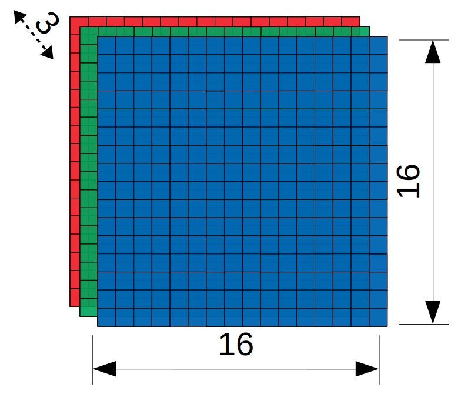

   Figure: 16x16 3-Channel RGB Image

The convolution layer consists primarily of the multiply-accumulate (MACC) operation. The trained weights of a CNN are realized using what is called a "kernel" which is just a square grid of trained weight values that is smaller in dimension than the input image. It is important to note that when working with 3-channel RGB images, a unique kernel grid must exist for each color-channel resulting in a 3-dimensional MxNx3 shaped kernel. This grid of weights functions as a sliding filter that moves over the image where in each iteration it is convolved with an equally sized sub-section of the input image. For each iterative location of the kernel, the image grid and kernel grid are multiplied element-wise. The resulting product from each pixel-weight multiplication is then summed together over all input channels to produce a scalar output. In a model for RGB images there will be one scalar valued neuron produced that corresponds to each iterative location of the applied kernel. For the next iteration the kernel is shifted over the image by one pixel such that it covers a slightly different portion of the input. The same MACC process is repeated for each subsequent iteration until all rows and columns of the image's grid-space have been convolved. The scalar outputs are then organized respectively to form a new grid of values called the "feature map". It is usually desirable to increase the depth from input to output by training additional sets of kernel weights. An output depth of two or three feature maps would be achieved by doubling or tripling the number of trained weights and repeating the same convolution with all kernel sets. These features are then passed forward to the next operation in the network. Described above is the most basic form of the convolution operation. 

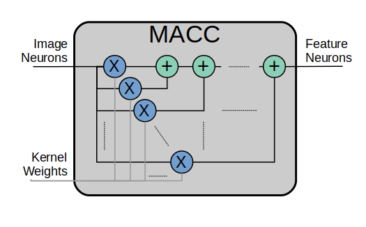

   Figure: Block design for the MACC operation.

There are additional features that are optional and can typically be enabled and adjusted by modifying parameters. In some situations it may be desirable to apply zero-padding to the convolution operation by surrounding the input image borders with zero-valued pixels. Applying a zero-padding of n pixel will increase the input image size by 2n in both the row and column dimension. For example, a 5x5x3 grid becomes 7x7x3 grid after applying zero-padding of one. Another common parameter used in convolution operations is stride length which by default will be one. Stride length controls the number of pixels in which the kernel will shift over the image for each iteration. Stride length can be increased to effectively downsample and thus reduce the size of the output feature map.

The aim of a convolution layer is to extract learned shapes and patterns frome the input images as features. To accomplish this, kernel weight values are learned using a set of training data consisting of pre-classified images. Optimal weights that will effectively extract the necessary features are adjusted through iterative back-propogation techniques. This is called supervised learning. A convolution layer typically reduces the row and column dimensions while increasing the depth or channel count. This allows for many features of the same input region to be learned. A decrease in pixel resolution is effective in order to prevent over-fitting since each feature does not require the entire resolution of the input. To increase the output's depth - and thereby increase the number of learned features - we use additional sets of kernel weights that are trained and applied to the inputs. Shown below is a visualization of the convolution operation with a 5x5 input and one zero-padding. It shows two sets of 3x3x3 kernel weights convolve over the input with a stride of two. The output generated is a 3x3x2 feature map.

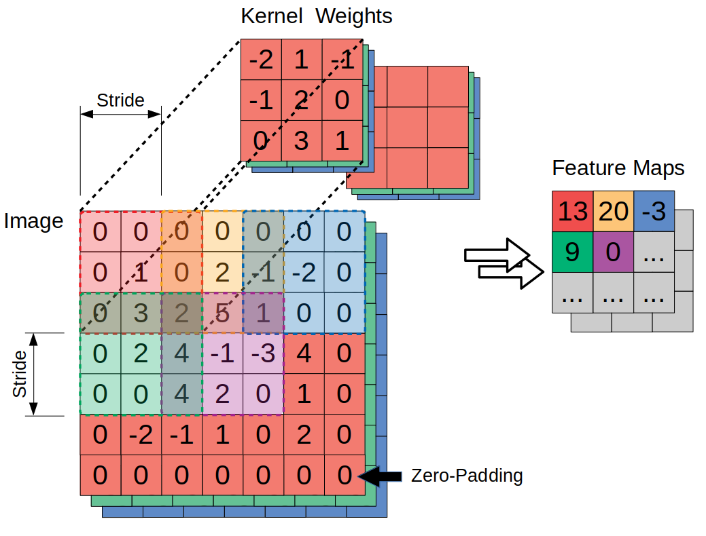

   Figure: Visualized convolution operation. [Input Image: 5x5x3 (RGB); Kernel Weights: 3x3x6; Zero-padding = 1; Stride = 2; Output Feature: 3x3x6]

Implementing a convolution function in hardware is computationally expensive and will require a fair amount of processing resources. Convolution operations will typically consume the majority of the total processing resources in CNN models. Intuitively, the convolution operations will occupy the majority of the logic resources when implementing CNNs on FPGAs. 

Notice that convolutional blocks used in NN designs are for the most part all very similar with just a few adjustments. The only differences would be parameters such as the input and kernel sizes as well as other settings such as zero-padding and stride steps. These blocks have a high potential for modularity. A generic convolution block can be described using HDL just once and then instantiated as many times as needed. By modifying VHDL's **generic ports** when instantiating components, block parameters can be determined pre-synthesis allowing for differently configured convolution layers to be implemented throughout the model using the same HDL block.

Non-Linear Activation Block
---------------------------

The non-linear block implements an activation function for the primary purpose of introducing non-linearity to the CNN model. If a NN is not capable of utilizing non-linear properties then it will only be successful at modeling against a very basic set of data. The activation function is what unlocks the ability to train against complex object attributes we observe in the world around us. One of the most effective and also perhaps the most simple of the available activation functions is the rectified linear unit, more simply referred to as the ReLU operator. There are a few adaptions of the ReLU operator being used today, but the most basic form of ReLU simply converts all negative input values to zeros while leaving postive values unchanged.

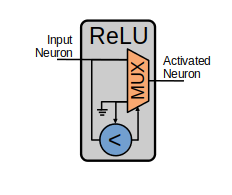

   Figure: Block design for ReLU operations.

Pooling Block
-------------

Pooling layers are useful in CNN designs because they limit computational complexity while also functioning to prevent over-fitting during training. Pooling can be thought of as a process of down-sampling the feature maps at the output of a convolutional layer. There are a number of different pooling functions that are used in CNN designs. Two very common functions are average-pooling and max-pooling. As the name suggests, the pooling function moves across the range of the feature map and consolidates or "pools" individual sections down to a single value. A typical example of a pooling operation is a 2x2 square that reduces every four feature map neurons down to a single max or averaged value neuron output. A 2x2 block that iterates over an 8x8 feature map without overlaps would effectively downsample the feature to a 4x4 output, cutting its dimensions in half [7].

Fully Connected Block
---------------------

The fully connected (FC) layer of a CNN is primarily used at the final stage of the network model and serves to transform the resulting feature activations into the final image classification. Multiple FC layers may, however, be used throughout the model as hidden layers. It is most common, however, for these to be instantiated in sequence of decreasing neuron size at the end of a model. The number of neurons used in each hidden layer can be adjusted during the design and training phase for optimizing performance. It is important to note though that the number of possible image classifications will determine the number of neurons in the final FC layer. Each classification label will be assigned to an output neuron and whichever neuron is most favored will be used as the network's prediction. As the name suggests, FC layers require that each neuron be connected to all the neurons of neighboring FC layers making them particularly resource heavy. Each neuron requires one trained bias value and a number of trained weight values equal to the number of neurons in the following FC layer. These layers require a large overhead of trained values that must be stored in memory and made available to the model when needed.

Available Tool-flows
====================

Due to the modular nature of a NN with its individual functional components, people quickly theorized and implemented generic constructs that can scale in size, be re-ordered, or even be swapped out for alternative components. Hardware description language (HDL) designs take in parameters pre-synthesis and use them to define compatible interfaces and to implement desired functionality for specific implementations. There already exists a number of tools capable of auto-generating HDL for realizing NN models in PL. Some tools require the user to describe the model in an abstract high-level language whereas others don't require programming any code at all. This is important since the majority of software developers and scientists seeking to apply ML in their work are not experienced with the nuances of HDL design. In addition, describing a NN from scratch using HDL could become an arduous task especially if the designer does not have the experience level needed to benefit from the potential of design modularity NNs provide. The development of accessible tool-flows and libraries is an important step forward in reducing the barrier to entry for FPGA use in ML applications. We briefly explore here open-source tool-flows currently available that provide auto-generation of synthesizable code for building CNN models.

A surprisingly large number of frameworks have already been developed - mostly through university research - that provide users with accessible design frameworks for CNN implementations on PL without requiring custom handwritten HDL. These frameworks harness the inherent modularity of CNN blocks to provide users with the capability of auto-generating a complete HDL description that implements their desired model. The developer interface varies among the available frameworks but most frequently resorts to a high-level synthesis language approach. Frameworks such as HADDOC2 and DnnWeaver provide compatibility with models that have been developed with Caffe which is a very popular DNN framework with a python interface. By adapting a framework that is already familiar in the deep learning (DL) community, these tools are opening the doors for DNN inference on FPGAs to a broader spectrum of potential DNN developers. 

[DnnWeaver] employs an architecture most closely resembling the single engine architecture. The tool takes in models that use the popular Caffe format. The developers of DnnWeaver created a macro dataflow instruction set architecture (ISA) so that the Caffe models can be parsed and stored as one or two 64-bit words. This model-derived instruction set - along with the target FPGA specs - is used to configure and connect an optimized combination of pre-designed hardware templates in order to realize the model. In addition, the ISA will generate a static process sequence schedule to orchestrate optimized dataflow. Memory access efficiency is optimized using computation slicing to allow for data-reuse. The algorithm seeks to create an effective balance between data-reuse and parallelization techniques. An optimized acceleration engine is then generated with embedded FSMs and microcodes based off the derived scheduler. According to the evaluation presented in [Toolflows], DnnWeaver achieves the highest portability rating for target FPGA devices. The tool excels in customization, modularity, and scalability but received lower scores in metrics that include optimization and performance density. An in-depth comparison and analysis of these and many other tools can be found in [Toolflows].

Architecture
============

By creating generic operational blocks we can start to imagine simplified and abstracted methods for assembling NNs on an FPGA. Creating a model in programmable logic purely through hand written HDL would be arduous and repetitive. Such a large portion of the physical design can be collapsed down into generic logical pieces, reducing the number of lines of HDL code and also reducing the time spent copying/pasting and reordering code slices for new iterations of the model design. This DNN attribute of having a few basic building blocks that assemble together with different parameters in various configurations provides huge advantages in facilitating efficient design iterations. This is important since the majority of scientists and engineers that want to incorporate ML in their work do not have a strong programmable logic background or experience coding HDL. The involved process and complex nature of FPGA/SoC design - apparent to those seeking out programmable logic solutions for ML applications - proves to be a significant barrier to entry. I speculate that it is partly for this reason that FPGAs are not the common choice for DNN solutions. However, because of the high degree of DNN modularity discussed, this market pattern could soon change. 

Two broad categories of CNN architectures as stated in [Toolflows] include the streaming accelerator architecture and the single engine architecture. 

Streaming Accelerator Architectures
-----------------------------------

Streaming accelerator architectures are characterized as having each of its layers individually instantiated in logic with parameters optimized for a specific model. Each layer will have data streaming out to the following operation while data from the preceding stage will flow in. This happens for all layers concurrently such that utilization of the implemented resources is maximized. An advantage of the streaming approach is that feature data between operations does not require the use of off-chip memory access. This alleviates memory bandwidth while improving the achievable classification latency. 

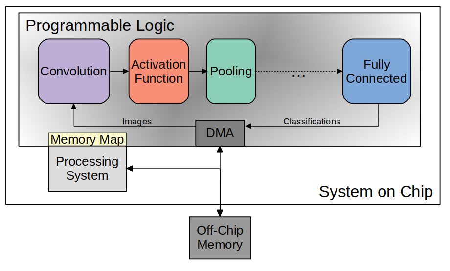

  Figure: Streaming Architecture Example

Single Engine Architectures
---------------------------

Single engine architectures, as the name implies, take the form of a single powerful accelerated computation engine capable of executing each layer of the CNN model sequentially. This type of implementation can take on many variations but typically requires a control unit or finite-state machine (FSM) that moderates data-flow and schedules sequences of operation. The single engine will consist of an array of processing elements that support SIMD matrix operations for completing convolutions, non-linear functions, pooling and other required operations all in a single engine. One huge advantage of this approach is the potential for a single FPGA design to operate on many different model configurations and data sets without the need for re-programming. This allows for increased flexibility but at the cost of reduced resource utilization efficiency as well as consistency of performance results. Although simple models could get by with only on-chip memory (OCM) use, complex models will require significantly more access to off-chip memory than a comparable streaming architecture. 

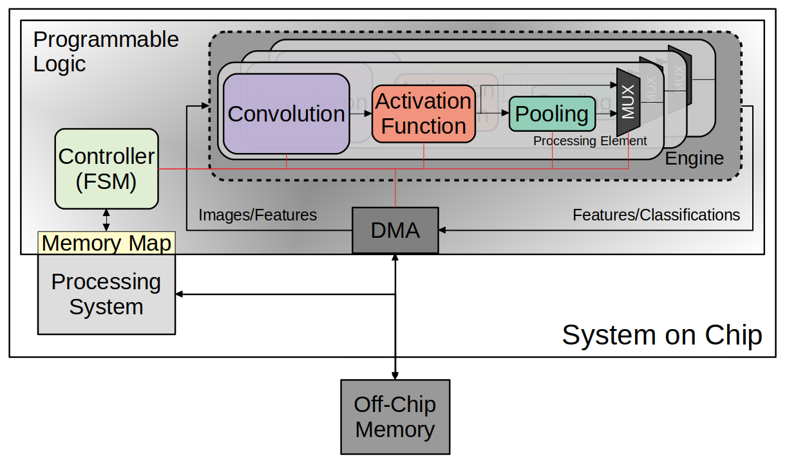

   Figure: Single-Engine Architecture Example

FPGA vs. GPU
============

Although GPUs have been greatly beneficial for the advancement of DNN performance, there are a few drawbacks. High performing GPUs consume large amounts of energy and are thus particularly limited in mobile and other power-constrained applications. In addition, the development of NNs on GPUs requires the use of an application programming interface (API) which provides access to parallel processing capabilities for general purpose use cases. This extra layer of abstraction from the hardware reduces the maximum achievable hardware efficiency and increases overall energy consumption. As for the APIs available, NVIDIA's CUDA platform provides developers with a comprehensive library for NN support on NVIDIA GPUs. NVIDIA's active development in the CUDA framework and its features will no doubt make improvements on performance and efficiency. Due to the static nature of a GPU's architecture, however, there is little room for implementation of application specific acceleration engines and custom data-types. These are the situations in which FPGAs will be chosen above GPUs.

Considerations for Efficient Implementation
===========================================

Data Quantization
-----------------

Data quantization is a technique that can provide a significant reduction in the required computation and memory resources as well as memory bandwidth. The extreme flexibility provided by FPGAs allows for customizing the data type and size to fit the application. CPUs and GPUs are designed with pre-determined precision. This means that on a 32-bit GPU, a small value operation that requires only 8-bit precision would still consume the full 32-bit operation resource. This inefficiency can be uniquely solved with the FPGA's ability to configure computation resources using only the level of precision required. Many applications exist where high resolution computations do not provide measurable improvements in overall NN performance. In such cases, models can be implemented in FPGAs with reduced precision to provide benefits such as reduced power consumption, increased throughput, or additional resource and memory capacity for other operations. Take for example a model that inputs RGB images with 8-bit resolution per color channel. Using quantization, the 8-bit channel resolutions can be reduced down to 4-bits or even 2-bits to significantly reduce resource utilization. Alternatively, quantization could be applied to other image dimensions by reducing the pixel count or even through monochromatic conversion. In all cases, kernel weight parameters should be adjusted accordingly. Classification accuracy can be tested for each configuration to observe any degradation in performance.

We evaluate the benefits of data quantization using an implementation of a fully unrolled convolution block; the design of this block is discussed later in the report. Channel resolutions for both the image and kernel weights were adjusted with 8, 4, and 2 bit resolution for three separate implementation runs. Resulting resource utilization is shown in the table below.

+----------------------------------+------+------------------+-----------+-------------+
| Resolution                       | LUTs | LUT %            | Registers | Registers % |
+==================================+======+==================+===========+=============+
| 8-bit                            | 3974 | Reference (100%) | 144       | 100%        |
+----------------------------------+------+------------------+-----------+-------------+
| 4-bit                            | 1073 | 27%              | 72        | 50%         |
+----------------------------------+------+------------------+-----------+-------------+
| 2-bit                            | 267  | 6.7%             | 36        | 25%         |
+----------------------------------+------+------------------+-----------+-------------+

The results of this test show significant savings in computation resource usage. Reducing bit-width from 8-bit to 4-bit provided a 73% reduction in LUTs and a 50% reduction in registers. Further quantization to 2-bit values provided a total of 93.3% reduction in LUTs and a 75% reduction in registers. It is evident that tremendous resource savings can be achieved using data quantization techniques. However, classification accuracy will need to be evaluated for the specific application to determine whether quantization is a viable option.

Binarized Neural Networks
-------------------------

Binarized neural networks (BNN) take the concept of data quantization to the extreme by reducing bit-widths to the minimum required. Fully binarized networks use single-bit values for layer inputs and outputs as well as for trained weights effectively realizing an on/off activated model. FPGAs are especially well suited for optimizing these custom-type implementations given their ability to configure logic to use only the precision required. This means that common CNN operations such as convolution - requiring many MACC operations - become much less expensive. FINN is an open-source BNN tool developed by Xilinx Research Labs [FINN] that is capable of implementing both fully-binarized and partially-binarized neural networks. Given the extreme level of quantization and resource savings, results have demonstrated impressive classification accuracy. More impressive, however, is the extremely high throughput and low latency that can be achieved (see table). Their results demonstrate the potential efficiency of BNNs on FPGAs but also highlights limitations in classification accuracy when using large image models.

+--------------------------------------+----------------------------+---------+----------+
| Dataset                              | Throughput (Images/Second) | Latency | Accuracy |
+======================================+============================+=========+==========+
| MNIST                                | 12.3 million               | 0.31 us | 95.8%    |
+--------------------------------------+----------------------------+---------+----------+
| CIFAR-10                             | 21,906                     | 283 us  | 80.1%    |
+--------------------------------------+----------------------------+---------+----------+

The following summary describes the techniques which FINN uses to implement a highly efficient BNN. First is the popcount accumulator which serves as the dot product summation operation during convolution. All synapses coming into a neuron are single-bit values and can be stored as an array. The popcount operation simply adds up all the set bits in this array and outputs the sum. Popcount provides a 50% reduction in resource usage in comparison to the alternative signed accumulator. A thresholding unit is then applied to this sum and will serve as a simple binary implementation of the Batchnorm-activation function. The threshold value and polarity is constant and can be determined from the learned weights of a full batchnorm-activation process that result from training.

.. math::
    
    \[
        Learned weights: \Theta_k = (\lambda_k, \mu_k, \i_k, B_k)
        BatchNorm(a_k, \Theta_k) = \lambda_k (a_k - \mu_k) i_k + B_k
        BatchNorm(a_k, \Theta_k) = 0 -> \Tau_k = mu_k - \frac{B_k}{\lambda_k i_k}
        Threshold: \Tau_k^+ = \frac{|Tau_k + S_{Fan-In}}{2}
    \]

(unfortunately I ran out of time to fix issues generating latex)

Using this training-weight-derived positive-only threshold value, we can now apply an unsigned comparator on the sum and the threshold and obtain a binary output. Thus, a simple comparator and a compile-time initialized constant can realize a binary batchnorm-activation using less than just 5% of the resources that would otherwise have been required. Lastly, FINN uses the simple logical OR operator to apply the max-pooling function on the results of the comparators. FINN shows that the majority of computation in a BNN can be synthesized down to nothing more than popcounters, comparators, and OR-gates. The paper goes on to describe the organizational architecture of their BNN which includes aggregating these operations into what they call matrix-vector-threshold units (MVTU). 

Loop Unrolling
--------------

Loop unrolling is a technique that has potential to both decrease a model's latency as well as increase its throughput capacity. Loop unrolling is what allows a design to capitalize on what FPGAs have been known to excel at. That is, parallel processing. As previously discussed, CNN models are primarily composed of SIMD type operations where a benefit can be realized by instantiating many processing elements - such as MACCs - in parallel. This is possible because convolution operations do not require an extensive number of calculations that need to execute in a specific sequence. In other words, the output of one MACC operation in a convolutional layer does not need to be made available to another MACC in that same layer. As is demonstrated later in this report, each of the popular CNN layers (convolution, activation, pooling...etc) can theoretically be executed in just a single clock cycle. Although the idea of classifying millions of images every second is exciting, there are two primary restraints when attempting to unroll a model. First is the apparent limitation of available logic resources on an FPGA. A fully unrolled layer such as convolution could easily consume the resources of an entire logic device, depending on the device and the dimensions of the image. The second restraint is timing closure. A large convolution kernel will require the summation of many multiplier products. All these multiply and adder circuits will need to resolve before the arrival of the following clock edge which will lock the final result into a register. If the propagation delays are too long or the clock is too fast, an implemented design will fail timing analysis meaning that the clock could register erroneous data.

Folding
-------

Folding (also known as time-multiplexing) has the opposite effect of loop unrolling. It is the sharing of a single computational resource among multiple operations that are executed during different time intervals. This technique can be used to optimize resource utilization when certain processes are not required to run all the time. For example, let us say that every 50 clock cycles operation A generates a result which is used as an input to operation B. Once operation B consumes that result it takes only 10 clocks to finish its calculation and then waits for the next result from A. This means that the composition of resources for operation B are not utilized 80% of the time and is thus not optimal. In this situation, loop unrolling operation B will not benefit the system but will instead consume under-utilized resources. If possible, it would be beneficial to construct the model such that the computation resources of operation B are shared over time partitions with other operations in the model. Time-multiplexing fully-utilized resources will of course increase overall system latency and decrease throughput. This may be required for larger designs or when constrained to smaller FPGA devices. Together, loop unrolling and folding can be used to balance a system's performance and optimize efficiency, ultimately maximizing capability.

**Post-Synthesis Convolution Utilization with and without Folding:**

* Image Size:   10x10
* Channels:     1
* Resolution:   8-bit
* Stride:       1
* Padding:      0

+------------------------------------------------------+-----------+------------------+-----------------+
| Site Type                                            | Available | Used w/o Folding | Used w/ Folding |
+======================================================+===========+==================+=================+
| Slice LUTs                                           | 17600     | 45121 (256.37%)  | 1950 (11.08%)   |
+------------------------------------------------------+-----------+------------------+-----------------+
| Slice Registers                                      | 35200     | 512 (1.45%)      | 532 (1.51%)     |
+------------------------------------------------------+-----------+------------------+-----------------+
| F7 Muxes                                             | 8800      | 0 (0.00%)        | 102 (1.16%)     |
+------------------------------------------------------+-----------+------------------+-----------------+
| F8 Muxes                                             | 4400      | 0 (0.00%)        | 0 (0.00%)       |
+------------------------------------------------------+-----------+------------------+-----------------+

This Project's Design and Implementation
========================================

My design uses VHDL as the hardware description programming language. In order to make use of this code, the tools must support the IEEE VHDL-2008 standard. Vivado 2019.1 supports some but not all of the features provided by VHDL-2008. Multi-dimensional arrays of three dimensions were successfully synthesized and implemented using the Vivado IDE. Vivado does not, however, support simulation for these three-dimensional arrays. In addition, Vivado does not allow modules defined as VHDL-2008 to be dropped into block designs. Block designs are commonly used in Vivado design methodologies as the design's top layer definition. VHDL-2008 modules can be wrapped inside other modules that are defined as the default VHDL type prior to instantiation into the block design.

Custom Types
------------

.. code-block:: VHDL

  -- Type definition
  type GridType is array(natural range <>, natural range <>, natural range <>) of unsigned;

  -- Example declaration for 32x32 pixel RGB (3-channel) image w/ 8-bit color resolution
  signal Input_Image is array(1 to 32, 1 to 32, 1 to 3)(7 downto 0);

GridType is used to represent a single image or kernel as a three-dimensional array of customizable bit-width values. When instantiating a GridType signal or variable, the length of each dimension along with the bit resolution must be defined.

Convolution
-----------

The goal of this first convolution module design is to realize a highly modular and scalable building block that can be used to define a variety of convolutional layer types by using **generic** parameters that are selected pre-synthesis. These parameters allow the module to support any image size or input feature map of four or less dimensions. The first three array dimensions represent the number of rows, columns and channels. The final dimension is for bit resolution of color gradient values and this may also be customized. The dimensions of the output feature map will be calculated automatically.

This first module was designed as a fully loop-unrolled single-clock convolution accelerator. This means that a successful implementation will process one full image (or feature map) input in just one clock cycle. If desired, all kernel weights can be updated for every image that is processed. The obvious drawback to this fully parallelized implementation is the high utilization of logic slice look-up tables (LUTs). Feasibility and limitations of its full implementation including place-and-route is described in the following sections.

Due to the redundancy of convolution operations, the VHDL **for-loop** construct can provide an elagant solution for the replication of many MACC operations. Unlike software programming languages which use the **for-loop** to repeat sequential operations, VHDL will instead replicate the logic described within the loop for each iteration. Multidimensional arrays used with looping constructs provides the capability for writing much less repetitive code that promotes reusability and effortless customization. In addition to the adjustable image dimensions, **generic** ports provide customizable parameters to support kernel strides greater than one and zero-padding. Looping constructs within the main process provides a convenient and readable implementation of custom stride length. If selected, zero-padding is applied to the input data using VHDL **for-generate** statements. When these features are not desired, setting stride to one and padding to zero will disable them.

Equations for sizing the feature map outputs using the input parameter settings and operation settings such as zero-padding and stride length were found here [https://arxiv.org/pdf/1603.07285.pdf].

.. math::
  
  \[ o = \frac{i + 2p - k}{s} + 1 \]

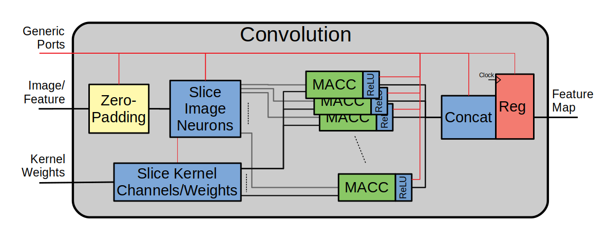

   Figure: Block design of the fully-unrolled convolution module.

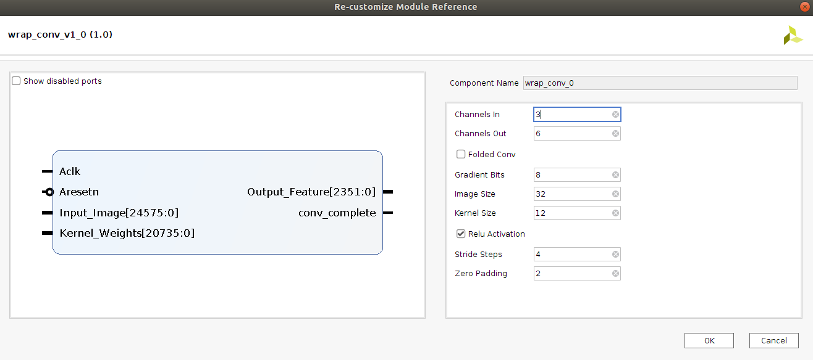

   Figure: Convolution block drop in IP for Vivado block designs.

**HDL - Fully-Unrolled Convolution Module**

.. code-block:: VHDL

  -- convolution.vhd

  library IEEE;
  use IEEE.STD_LOGIC_1164.ALL;
  use IEEE.NUMERIC_STD.ALL;
  use IEEE.math_real.all;
  library xil_defaultlib;
  use xil_defaultlib.mypackage.ALL;
  
  entity convolution is
    Generic(
      IMAGE_SIZE      : positive;
      KERNEL_SIZE     : positive;
      CHANNELS_IN     : positive;
      GRADIENT_BITS   : positive;
      CHANNELS_OUT    : positive;
      STRIDE_STEPS    : positive;
      ZERO_PADDING    : natural;
      RELU_ACTIVATION : boolean
    );
    Port (  
      Aclk            : in std_logic;
      Aresetn         : in std_logic;
      Input_Image     : in GridType(  
        1 to IMAGE_SIZE,
        1 to IMAGE_SIZE,
        1 to CHANNELS_IN
        ) (GRADIENT_BITS - 1 downto 0);
      Kernel_Weights  : in GridType(  
        1 to KERNEL_SIZE,
        1 to KERNEL_SIZE,
        1 to CHANNELS_IN * CHANNELS_OUT
        ) (GRADIENT_BITS - 1 downto 0);
      Output_Feature  : out GridType( 
        1 to (IMAGE_SIZE + 2 * ZERO_PADDING - KERNEL_SIZE) / STRIDE_STEPS + 1,
        1 to (IMAGE_SIZE + 2 * ZERO_PADDING - KERNEL_SIZE) / STRIDE_STEPS + 1,
        1 to CHANNELS_OUT
        ) (GRADIENT_BITS - 1 downto 0)
    );
  end convolution;
  
  architecture Behavioral of convolution is
  
    -- Prevents overflow during summation (subtract one because signed)
    constant BITS4SUM : integer := integer(ceil(log2(real(KERNEL_SIZE**2)))) - 1;
  
    -- Grid after applying zero-padding
    signal Padded_Image : GridType(
      1 to IMAGE_SIZE + 2 * ZERO_PADDING,
      1 to IMAGE_SIZE + 2 * ZERO_PADDING,
      1 to CHANNELS_IN
      ) (GRADIENT_BITS - 1 downto 0);
  
  begin
  
    ----------- Generate zero-padded image -----------
    gen_row : for row in Padded_Image'range(1) generate
      gen_col : for col in Padded_Image'range(2) generate
        gen_chn : for chn in Padded_Image'range(3) generate
          -- Fill with input image when out of padding range
          gen_zp : if (row > ZERO_PADDING) and 
                (col > ZERO_PADDING) and 
                (row <= Padded_Image'high(1) - ZERO_PADDING) and 
                (col <= Padded_Image'high(2) - ZERO_PADDING) generate
            Padded_Image(row, col, chn) <= Input_Image(row - ZERO_PADDING, col - ZERO_PADDING, chn);
          else generate
            Padded_Image(row, col, chn) <= (others => '0');
          end generate gen_zp;
        end generate gen_chn;
      end generate gen_col;
    end generate gen_row;
    --------------------------------------------------
  
    --------------- Convolution Process --------------
    convolution_process : process(Aclk, Aresetn)
      variable feature_sum : signed(2 * GRADIENT_BITS + BITS4SUM - 1 downto 0);
    begin
      if Aresetn = '0' then
        Output_Feature <= (others => (others => (others => (others => '0'))));
      elsif rising_edge(Aclk) then
        for conv_row in Output_Feature'range(1) loop
          for conv_col in Output_Feature'range(2) loop
            for conv_chn in Output_Feature'range(3) loop
              -- Clear summation
              feature_sum := (others => '0');
              -- Un-rolled MACC operations
              for macc_row in Kernel_Weights'range(1) loop
                for macc_col in Kernel_Weights'range(2) loop
                  for macc_chn in 1 to CHANNELS_IN loop
                    ----- Multiply Accumulate -----
                    feature_sum := feature_sum
                      -- Add Input Neuron
                      + Padded_Image(
                        STRIDE_STEPS * (conv_row - 1) + macc_row, 
                        STRIDE_STEPS * (conv_col - 1) + macc_col, 
                        macc_chn)
                      -- Multiplied by Kernel Weight
                      * Kernel_Weights(
                        macc_row, 
                        macc_col, 
                        CHANNELS_IN * (conv_chn - 1) + macc_chn);
                    -------------------------------
                  end loop;
                end loop;
              end loop;
              -- Apply ReLU activation
              if RELU_ACTIVATION and to_integer(feature_sum) < 0 then
                Output_Feature(conv_row, conv_col, conv_chn) <= (others => '0');
              else
                -- Scale down Result
                Output_Feature(conv_row, conv_col, conv_chn) 
                  <= feature_sum(feature_sum'high downto feature_sum'high - GRADIENT_BITS + 1);
              end if;
            end loop;
          end loop;
        end loop;
      end if;
    end process;
    --------------------------------------------------
    
  end Behavioral;

.. figure:: figs/convolution_elaborated_00-1.png

   Figure: Elaborated circuit of the convolution module using the Vivado IDE (Image Size: 4x4, Kernel Size: 2x2, Color Channels: 3)

**Post-Synthesis Utilization Report (ZYBO Dev Board)**

+-------------------------------------------------------+------+-----------+---------------+
| Site Type                                             | Used | Available | Utilization % |
+=======================================================+======+===========+===============+
| LUT as Logic                                          | 2882 | 17600     | 16.38         |
+-------------------------------------------------------+------+-----------+---------------+
| LUT as Memory                                         | 0    | 6000      | 0.00          |
+-------------------------------------------------------+------+-----------+---------------+
| Register as Flip Flop                                 | 144  | 35200     | 0.41          |
+-------------------------------------------------------+------+-----------+---------------+
| Register as Latch                                     | 0    | 35200     | 0.00          |
+-------------------------------------------------------+------+-----------+---------------+

Simulation:

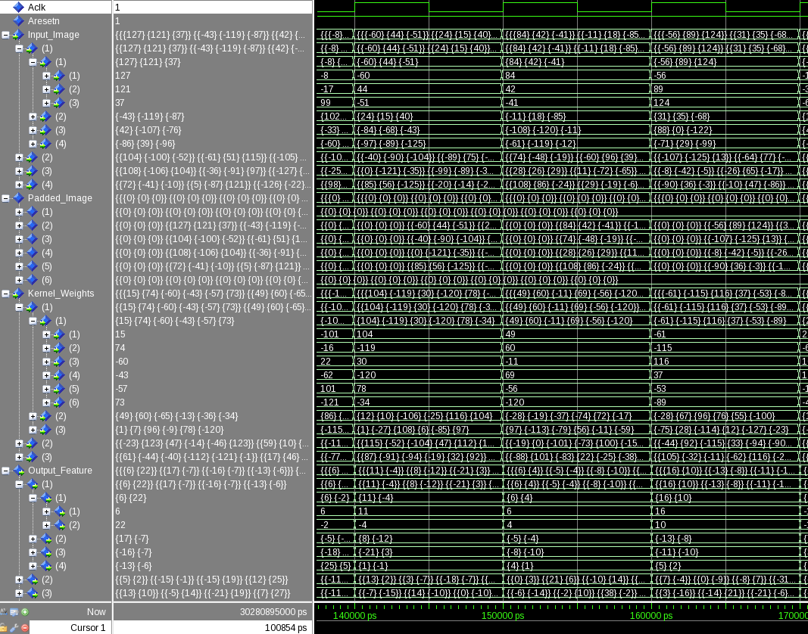

   Figure: Test bench simulation of the fully-unrolled convolution module.

**Testbench results Verification:**

In order to verify that these modules were operating as expected, a python script was developed (see Appendix) using the PyTorch conv2d function. Results are compared and displayed below.

.. code-block:: python

  ----------------------------------------
  Input Size:             4 x 4 x 3
  Kernel Size:            3 x 3 x 3 x 2
  Output Feature Size:    4 x 4 x 2
  Resolution:             8 - bit
  Stride Steps:           1
  Zero Padding:           1
  ReLU Activation:        0
  Number of Batches:      10
  ----------------------------------------
  Check Passed. All 320 data items match.
  ----------------------------------------

**2nd Simulation and verification:**

.. code-block:: python

  ----------------------------------------
  Input Size:             32 x 32 x 3
  Kernel Size:            9 x 9 x 3 x 12
  Output Feature Size:    10 x 10 x 12
  Resolution:             8 - bit
  Stride Steps:           3
  Zero Padding:           2
  ReLU Activation:        0
  Number of Batches:      10
  ----------------------------------------
  Check Passed. All 12000 data items match.
  ----------------------------------------

Folded Convolution
------------------

It quickly becomes apparent that a fully-unrolled convolution block is not a sustainable method of implementing large CNN models. This is due to high resource usage and difficulty with timing closure. In order to alleviate resource utilization, folding of MACC operations over multiple clocks allows logic to be reused iteratively over time. Unfortunately, VHDL does not provide a straightforward method for extending iterative loops over multiple clock cycles. Thus an iterator module was developed which can be instantiated for any scenario that requires iterating through multi-dimensional "GridType" arrays over multiple clock cycles. 

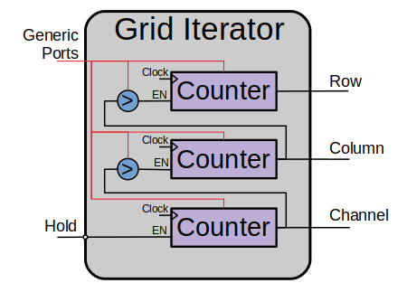

   Figure: Simplified diagram of the grid iterator module.

**HDL - Grid Iterator Module**

.. code-block:: VHDL

  -- grid_iterator.vhd
  
  library IEEE;
  use IEEE.STD_LOGIC_1164.ALL;
  use IEEE.NUMERIC_STD.ALL;
  use IEEE.math_real.all;
  library xil_defaultlib;
  use xil_defaultlib.mypackage.ALL;
  
  entity grid_iterator is
      Generic(
          GRID_SIZE    : natural := 8;
          CHANNEL_COUNT   : natural := 3
      );
      Port (
          Aclk    : in std_logic;
          Aresetn : in std_logic;
          hold    : in boolean;
          row     : out integer range 1 to GRID_SIZE;
          column  : out integer range 1 to GRID_SIZE;
          channel : out integer range 1 to CHANNEL_COUNT
      );
  end grid_iterator;
  
  architecture Behavioral of grid_iterator is
  
  begin
  
      process(Aclk, Aresetn)
      begin
          if Aresetn = '0' then
              row <= 1;
              column <= 1;
              channel <= 1;
          elsif rising_edge(Aclk) then
              -- Pause iterations while hold is asserted
              if not hold then 
                  if channel >= CHANNEL_COUNT then
                      if column >= GRID_SIZE then
                          if row >= GRID_SIZE then
                              row <= 1;
                          else
                              row <= row + 1;
                          end if;
                          column <= 1;
                      else
                          column <= column + 1;
                      end if;
                      channel <= 1;
                  else
                      channel <= channel + 1;
                  end if;
              end if;
          end if;
      end process;
  
  end Behavioral;

The design quickly becomes much more complex when facilitating folding operations and organizing data-flow using methods that promote efficiency of resource usage. Additional control logic and signals were required for coordination between the convolution process and the input/output data streams. Two folded designs were developed and tested to observe how folding of MACC operations would affect FPGA utilization. The first design applied folding such that each kernel step required one clock cycle. This extended the convolution operation over a number of clocks equal to the number of neurons in the feature-map output. For example, an 8x8 3-channel input with a 4x4 kernel would require *3\*(8-4+1)^2 = 75* clocks. In this design, a 4x4 kernel will instantiate logic for 16 individual multipliers and 15 adders in order to process the MACC operation in a single clock. By time-multiplexing numerous MACC operations on a single instance, this design provided great improvements in resource usage. 

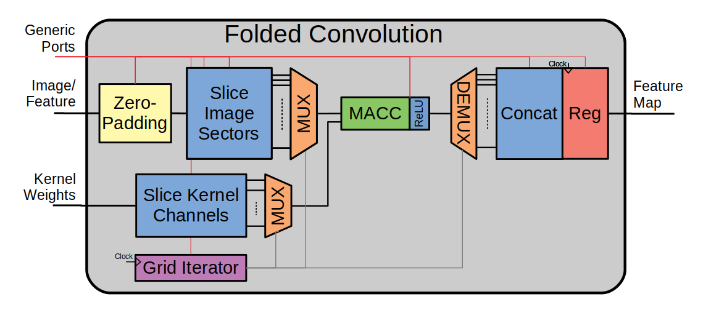

   Figure: Convolution module with folded MACC operations.

**HDL - Partially-Folded Convolution Module**

.. code-block:: VHDL

  -- folded_conv_v1.vhd
  
  library IEEE;
  use IEEE.STD_LOGIC_1164.ALL;
  use IEEE.NUMERIC_STD.ALL;
  use IEEE.math_real.all;
  library xil_defaultlib;
  use xil_defaultlib.mypackage.ALL;
  
  entity folded_conv_v1 is
    Generic(
      IMAGE_SIZE      : positive;
      KERNEL_SIZE     : positive;
      CHANNELS_IN     : positive;
      GRADIENT_BITS   : positive;
      CHANNELS_OUT    : positive;
      STRIDE_STEPS    : positive;
      ZERO_PADDING    : natural;
      RELU_ACTIVATION : boolean
    );
    Port (  
      Aclk            : in std_logic;
      Aresetn         : in std_logic;
      Input_Image     : in GridType(  
        1 to IMAGE_SIZE,
        1 to IMAGE_SIZE,
        1 to CHANNELS_IN
        ) (GRADIENT_BITS - 1 downto 0);
      Kernel_Weights    : in GridType(  
        1 to KERNEL_SIZE,
        1 to KERNEL_SIZE,
        1 to CHANNELS_IN * CHANNELS_OUT
        ) (GRADIENT_BITS - 1 downto 0);
      Output_Feature  : out GridType( 
        1 to (IMAGE_SIZE + 2 * ZERO_PADDING - KERNEL_SIZE) / STRIDE_STEPS + 1,
        1 to (IMAGE_SIZE + 2 * ZERO_PADDING - KERNEL_SIZE) / STRIDE_STEPS + 1,
        1 to CHANNELS_OUT
        ) (GRADIENT_BITS - 1 downto 0);
      conv_complete   : out boolean
    );
  end folded_conv_v1;
  
  architecture Behavioral of folded_conv_v1 is
  
    -- Prevents overflow during summation (subtract one because signed)
    constant BITS4SUM : integer := integer(ceil(log2(real(KERNEL_SIZE**2)))) - 1;
  
    -- Grid after applying zero-padding
    signal Padded_Image : GridType(
      1 to IMAGE_SIZE + 2 * ZERO_PADDING,
      1 to IMAGE_SIZE + 2 * ZERO_PADDING,
      1 to CHANNELS_IN
      ) (GRADIENT_BITS - 1 downto 0);
  
    -- Convolution iterator signals
    signal conv_row  : integer range Output_Feature'range(1);
    signal conv_col  : integer range Output_Feature'range(2);
    signal conv_chn  : integer range Output_Feature'range(3);
  
    signal conv_edge : boolean;
  
  begin
  
    ----------- Generate zero-padded image -----------
    gen_row : for row in Padded_Image'range(1) generate
      gen_col : for col in Padded_Image'range(2) generate
        gen_chn : for chn in Padded_Image'range(3) generate
          -- Fill with input image when out of padding range
          gen_zp : if (row > ZERO_PADDING) and 
                (col > ZERO_PADDING) and 
                (row <= Padded_Image'high(1) - ZERO_PADDING) and 
                (col <= Padded_Image'high(2) - ZERO_PADDING) generate
            Padded_Image(row, col, chn) <= Input_Image(row - ZERO_PADDING, col - ZERO_PADDING, chn);
          else generate
            Padded_Image(row, col, chn) <= (others => '0');
          end generate gen_zp;
        end generate gen_chn;
      end generate gen_col;
    end generate gen_row;
    --------------------------------------------------
  
    --------------- Compute convolution --------------
    process(Aclk, Aresetn)
      variable feature_sum : signed(2 * GRADIENT_BITS + BITS4SUM - 1 downto 0);
    begin
      if Aresetn = '0' then
        Output_Feature <= (others => (others => (others => (others => '0'))));
      elsif rising_edge(Aclk) then
        -- Clear summation
        feature_sum := (others => '0');
        -- Un-rolled MACC operations
        for macc_row in Kernel_Weights'range(1) loop
          for macc_col in Kernel_Weights'range(2) loop
            for macc_chn in 1 to CHANNELS_IN loop
              ----- Multiply Accumulate -----
              feature_sum := feature_sum
                -- Add Input Neuron
                + Padded_Image(
                  STRIDE_STEPS * (conv_row - 1) + macc_row, 
                  STRIDE_STEPS * (conv_col - 1) + macc_col, 
                  macc_chn)
                -- Multiplied by Kernel Weight
                * Kernel_Weights(
                  macc_row, 
                  macc_col, 
                  CHANNELS_IN * (conv_chn - 1) + macc_chn);
              -------------------------------
            end loop;
          end loop;
        end loop;
        -- Apply ReLU activation
        if RELU_ACTIVATION and to_integer(feature_sum) < 0 then
          Output_Feature(conv_row, conv_col, conv_chn) <= (others => '0');
        else
          -- Scale down Result
          Output_Feature(conv_row, conv_col, conv_chn) 
            <= feature_sum(feature_sum'high downto feature_sum'high - GRADIENT_BITS + 1);
        end if;
      end if;
    end process;
  
    -- Convolution folding iterator state machine
    iterator_conv_folding : grid_iterator
      generic map (
        GRID_SIZE       => Output_Feature'high(1),
        CHANNEL_COUNT   => Output_Feature'high(3)
        )
      port map (
        Aclk    => Aclk,
        Aresetn => Aresetn,
        hold    => conv_complete,
        row     => conv_row,
        column  => conv_col,
        channel => conv_chn
        );
    conv_complete <= not conv_edge and (
                    (conv_row = Output_Feature'high(1)) 
                and (conv_col = Output_Feature'high(2))
                and (conv_chn = Output_Feature'high(3)));
    process(Aclk, Aresetn)
    begin
      if Aresetn = '0' then
        conv_edge <= FALSE;
      elsif rising_edge(Aclk) then
        conv_edge <= conv_complete;
      end if;
    end process;
    --------------------------------------------------
  
  end Behavioral;

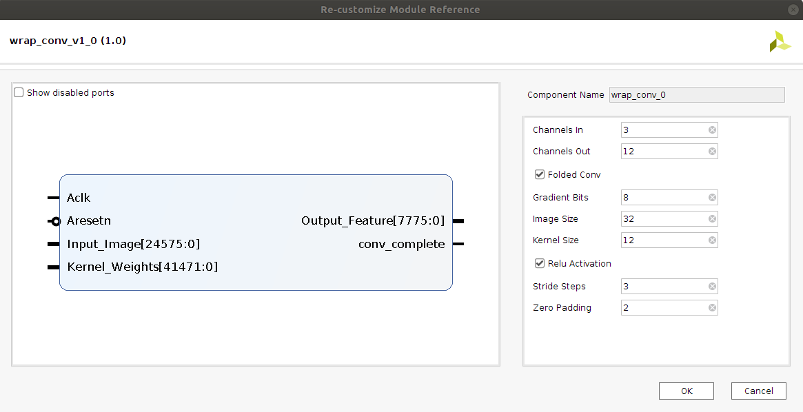

   Figure: Vivado IP generic settings for the wrapped partially-folded convolution module.

Testbench Simulation:

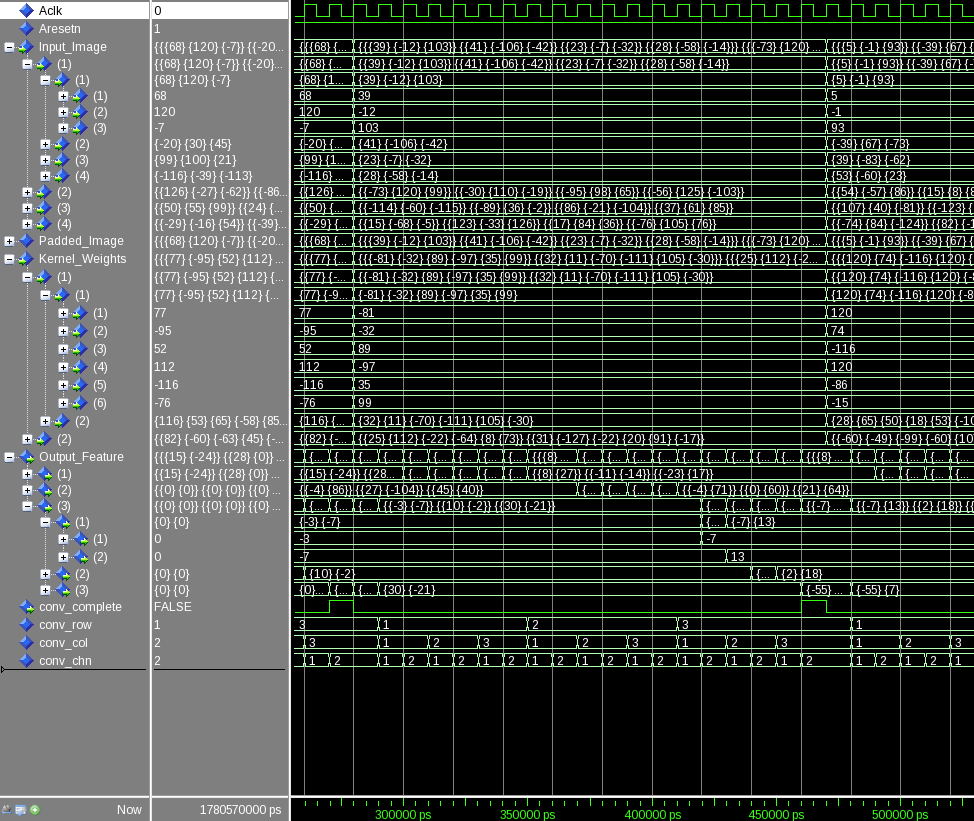

   Figure: Folded convolution v1 simulated testbench.

**Testbench Verification Check:**

The below two tests show that there was one incorrect result. This was due to methods of randome number generation combined with output scaling and was not able to be fixed before submission.

.. code-block:: python

  ----------------------------------------
  Input Size:             4 x 4 x 3
  Kernel Size:            2 x 2 x 3 x 2
  Output Feature Size:    3 x 3 x 2
  Resolution:             8 - bit
  Stride Steps:           1
  Zero Padding:           0
  ReLU Activation:        0
  Number of Batches:      10
  ----------------------------------------
  Check Failed. 1 out of 180 data items do not match.
  ----------------------------------------

**2nd Simulation and Verification**

.. code-block:: python

  ----------------------------------------
  Input Size:             32 x 32 x 3
  Kernel Size:            12 x 12 x 3 x 16
  Output Feature Size:    8 x 8 x 16
  Resolution:             8 - bit
  Stride Steps:           4
  Zero Padding:           4
  ReLU Activation:        0
  Number of Batches:      10
  ----------------------------------------
  Check Failed. 1 out of 10240 data items do not match.
  ----------------------------------------

Large kernels on this design will continue to prove difficult for resource constrained applications and is especially difficult for timing closure. The number of values to be summed in a MACC operation is equal to the number of weights in the kernel. For example, an 8x8 kernel would require 63 addition operations to be resolved before the next rising clock edge. As kernel sizes increase even further, place-and-route tools will have difficulty implementing physical logic that satisfies even a relatively slow running clock. Techniques can be used to guide the implementation tool towards a solution that will potentially satisfy timing. This could be done by describing VHDL with parallel adder operations on half the products with the other half and repeating the technique all the way down the chain until there is a single result. Rather than chaining together 63 adders in sequence, the tool would implement the same 63 additions in a sequence of 32-16-8-4-2-1 parallel adders decreasing the chain sequence down to just 6 steps. Another technique would be to apply timing constraints that allow for multi-cycle paths which would provide additional clock periods for the process to resolve. This would also require special considerations in iteration rates and clocking of data going in and out of the MACC unit and would increase design complexity accordingly.

The next design applies additional folding of the convolution block such that a single MACC will now sequentially process the entire convolution using just one multiply and one addition. The number of clocks required for this implementation will be equal to the number of neuron outputs multiplied by the number of weights in the kernel. The same 8x8 3-channel input with a 4x4 kernel will now require *3\*4^2\*(8-4+1)^2 = 1200* clock cycles to complete. Although this will provide additional resource savings, it will be at the cost of much greater latency and throughput. Additional resources are required to facilitate coordination of iterative operation sequences and in-turn drives up design complexity. The high degree of folding applied using iterator modules and data-flow logic in this design demonstrated poor resource utilization trade-offs given the massive increase in throughput and latency. Much of the logic resources saved by the reduction in MACC units was consumed by the additional iterator control logic required to orchestrate the folding process. This implementation method can certainly be changed, optimized, and improved upon in order to achieve greater efficiency trade-offs. The effort to make these improvements is difficult to justify though because a "fully-folded" sequential architecture will in a way defeat the purpose of using FPGAs to begin with. Regardless, this design exercise was beneficial for both the analysis and experience provided.

This design incorporates an input and output data streaming architecture for the input image and kernel weights and output feature map using the following streaming modules.

**HDL - Grid RX Stream Module**

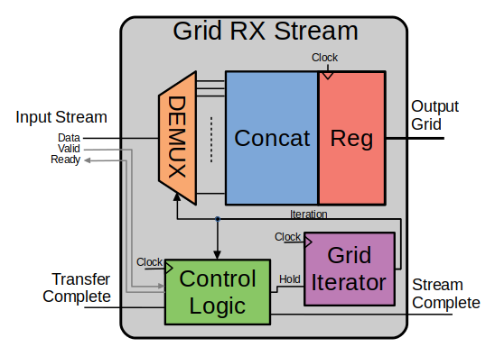

   Figure: Diagram of grid receive stream interface.

.. code-block:: VHDL

  -- stream_grid_rx.vhd
  
  library IEEE;
  use IEEE.STD_LOGIC_1164.ALL;
  use IEEE.NUMERIC_STD.ALL;
  use IEEE.math_real.all;
  library xil_defaultlib;
  use xil_defaultlib.mypackage.ALL;
  
  entity stream_grid_rx is
    Generic (
      GRID_SIZE       : natural := 6;
      CHANNEL_COUNT   : natural := 3;
      GRADIENT_BITS   : natural := 8
    );
    Port (
      Aclk     : in std_logic;
      Aresetn  : in std_logic;
      -- AXIS
      Stream_Data     : in std_logic_vector(GRADIENT_BITS-1 downto 0);
      Stream_Valid    : in boolean;
      Stream_Ready    : out boolean;
      -- Data
      Grid_Data : out GridType(
        1 to GRID_SIZE,
        1 to GRID_SIZE,
        1 to CHANNEL_COUNT
        ) (GRADIENT_BITS - 1 downto 0);
      -- Control
      Transfer_Complete   : in boolean;
      Stream_Complete     : out boolean
    );
  end stream_grid_rx;
  
  architecture Behavioral of stream_grid_rx is
  
    signal grid_hold : boolean;
    signal grid_row : integer range Grid_Data'range(1);
    signal grid_col : integer range Grid_Data'range(2);
    signal grid_chn : integer range Grid_Data'range(3);
  
  begin
  
    process(Aclk, Aresetn)
    begin
      if Aresetn = '0' then
        Stream_Complete <= FALSE;
        Grid_Data <= (others => (others => (others => (others => '0'))));
      elsif rising_edge(Aclk) then
        -------------------------
        if not grid_hold then
          Grid_Data(grid_row, grid_col, grid_chn) <= signed(Stream_Data);
        end if;
        -------------------------
        if (not Stream_Complete)  and (grid_row = Grid_Data'high(1)) 
                                  and (grid_col = Grid_Data'high(2)) 
                                  and (grid_chn = Grid_Data'high(3)) then
          Stream_Complete <= TRUE;
        elsif Transfer_Complete then
          Stream_Complete <= FALSE;
        end if;
        -------------------------
      end if;
    end process;
  
    iterator_stream_grid : grid_iterator
      generic map (
        GRID_SIZE       => Grid_Data'high(1),
        CHANNEL_COUNT   => Grid_Data'high(3)
        )
      port map (
        Aclk    => Aclk,
        Aresetn => Aresetn,
        hold    => grid_hold,
        row     => grid_row,
        column  => grid_col,
        channel => grid_chn
        );
    
    Stream_Ready <= Transfer_Complete or (not Stream_Complete);
    grid_hold    <= (not Stream_Valid) or (not Stream_Ready);
  
  end Behavioral;

**HDL - Grid TX Stream Module**

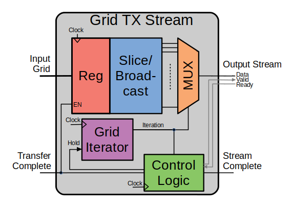

   Figure: Simplified diagram of grid transmit stream interface.

.. code-block:: VHDL

  -- stream_grid_tx.vhd
  
  library IEEE;
  use IEEE.STD_LOGIC_1164.ALL;
  use IEEE.NUMERIC_STD.ALL;
  use IEEE.math_real.all;
  library xil_defaultlib;
  use xil_defaultlib.mypackage.ALL;
  
  entity stream_grid_tx is
    Generic (
      GRID_SIZE       : natural := 6;
      CHANNEL_COUNT   : natural := 3;
      GRADIENT_BITS   : natural := 8
    );
    Port (
      Aclk     : in std_logic;
      Aresetn  : in std_logic;
      -- AXIS
      Stream_Data     : out std_logic_vector(GRADIENT_BITS-1 downto 0);
      Stream_Valid    : out boolean;
      Stream_Ready    : in boolean;
      -- Data
      Grid_Data : in GridType(
        1 to GRID_SIZE,
        1 to GRID_SIZE,
        1 to CHANNEL_COUNT
        ) (GRADIENT_BITS - 1 downto 0);
      -- Control
      Transfer_Complete   : in boolean;
      Stream_Complete     : out boolean
    );
  end stream_grid_tx;
  
  architecture Behavioral of stream_grid_tx is
  
    signal grid_hold : boolean;
    signal grid_row : integer range Grid_Data'range(1);
    signal grid_col : integer range Grid_Data'range(2);
    signal grid_chn : integer range Grid_Data'range(3);
  
  begin
  
    process(Aclk, Aresetn)
    begin
      if Aresetn = '0' then
        Stream_Complete <= FALSE;
        Stream_Data <= (others => '0');
      elsif rising_edge(Aclk) then
        -------------------------
        if not grid_hold then
          Stream_Data <= std_logic_vector(Grid_Data(grid_row, grid_col, grid_chn));
        end if;
        -------------------------
        if (not Stream_Complete)  and (grid_row = Grid_Data'high(1)) 
                                  and (grid_col = Grid_Data'high(2)) 
                                  and (grid_chn = Grid_Data'high(3)) then
          Stream_Complete <= TRUE;
        elsif Transfer_Complete then
          Stream_Complete <= FALSE;
        end if;
        -------------------------
      end if;
    end process;
  
    iterator_stream_grid : grid_iterator
      generic map (
        GRID_SIZE       => Grid_Data'high(1),
        CHANNEL_COUNT   => Grid_Data'high(3)
        )
      port map (
        Aclk    => Aclk,
        Aresetn => Aresetn,
        hold    => grid_hold,
        row     => grid_row,
        column  => grid_col,
        channel => grid_chn
        );
  
    Stream_Valid <= Transfer_Complete or (not Stream_Complete);
    grid_hold    <= (not Stream_Valid) or (not Stream_Ready);
  
  end Behavioral;

An additional module was created to encapsulate convolution operation and allow for independent evaluation of implemented MACC resource utilization. Notice how in this version of the convolution operation there are no **for-loop** statements to apply loop unrolling in the hardware.

**HDL - Convolution Process Module**

.. code-block:: VHDL

  -- process_conv.vhd
  
  library IEEE;
  use IEEE.STD_LOGIC_1164.ALL;
  use IEEE.NUMERIC_STD.ALL;
  use IEEE.math_real.all;
  library xil_defaultlib;
  use xil_defaultlib.mypackage.ALL;
  
  entity process_conv is
    Generic (
      IMAGE_SIZE      : positive;     -- I
      KERNEL_SIZE     : positive;     -- K
      CHANNELS_IN     : positive;     -- Ci
      GRADIENT_BITS   : positive;     -- B
      CHANNELS_OUT    : positive;     -- Co
      STRIDE_STEPS    : positive;     -- S
      ZERO_PADDING    : natural;      -- P
      RELU_ACTIVATION : boolean
      -- Feature Size: F = (I+2*P-K)/S + 1
      -- Clock Cycles: C = Ci*Co*F**2
      );
    Port (
      Aclk    : in std_logic;
      Aresetn : in std_logic;
      Conv_Image : in GridType(
        1 to IMAGE_SIZE,
        1 to IMAGE_SIZE,
        1 to CHANNELS_IN
        ) (GRADIENT_BITS - 1 downto 0);
      Conv_Kernel : in GridType(
        1 to KERNEL_SIZE,
        1 to KERNEL_SIZE,
        1 to (CHANNELS_IN * CHANNELS_OUT)
        ) (GRADIENT_BITS - 1 downto 0);
      Conv_Feature : out GridType(
        1 to (IMAGE_SIZE + 2 * ZERO_PADDING - KERNEL_SIZE) / STRIDE_STEPS + 1,
        1 to (IMAGE_SIZE + 2 * ZERO_PADDING - KERNEL_SIZE) / STRIDE_STEPS + 1,
        1 to CHANNELS_OUT
        ) (GRADIENT_BITS - 1 downto 0);
      macc_hold           : in boolean;
      macc_row            : in integer range 1 to KERNEL_SIZE;
      macc_col            : in integer range 1 to KERNEL_SIZE;
      macc_chn            : in integer range 1 to CHANNELS_IN;
      conv_hold           : in boolean;
      conv_row            : in integer range 1 to 
        (IMAGE_SIZE + 2 * ZERO_PADDING - KERNEL_SIZE) / STRIDE_STEPS + 1;
      conv_col            : in integer range 1 to 
        (IMAGE_SIZE + 2 * ZERO_PADDING - KERNEL_SIZE) / STRIDE_STEPS + 1;
      conv_chn            : in integer range 1 to CHANNELS_OUT;
      transfer_complete   : in boolean;
      conv_complete       : out boolean
      );
  end process_conv;
  
  architecture Behavioral of process_conv is
  
    -- Prevents overflow during summation (subtract one because signed)
    constant BITS4SUM : integer := integer(ceil(log2(real(KERNEL_SIZE**2)))) - 1;
  
    signal Padded_Image : GridType(
      1 to IMAGE_SIZE + 2 * ZERO_PADDING,
      1 to IMAGE_SIZE + 2 * ZERO_PADDING,
      1 to CHANNELS_IN
      ) (GRADIENT_BITS - 1 downto 0);
  
  begin
  
    ----------- Generate zero-padded image -----------
    gen_row : for row in Padded_Image'range(1) generate
      gen_col : for col in Padded_Image'range(2) generate
        gen_chn : for chn in Padded_Image'range(3) generate
          -- Fill with input image when out of padding range
          gen_zp : if (row > ZERO_PADDING) and 
                (col > ZERO_PADDING) and 
                (row <= Padded_Image'high(1) - ZERO_PADDING) and 
                (col <= Padded_Image'high(2) - ZERO_PADDING) generate
            Padded_Image(row, col, chn) <= Conv_Image(row - ZERO_PADDING, col - ZERO_PADDING, chn);
          else generate
            Padded_Image(row, col, chn) <= (others => '0');
          end generate gen_zp;
        end generate gen_chn;
      end generate gen_col;
    end generate gen_row;
    --------------------------------------------------
  
    --------------- Compute convolution --------------
    convolution_process : process(Aclk, Aresetn)
      variable feature_sum : signed(2 * GRADIENT_BITS + BITS4SUM - 1 downto 0);
    begin
      if Aresetn = '0' then
        conv_complete <= FALSE;
        feature_sum := (others => '0');
        Conv_Feature <= (others => (others => (others => (others => '0'))));
      elsif rising_edge(Aclk) then
        if not conv_complete then
          ----- Multiply Accumulate -----
          feature_sum := feature_sum
            -- Add Input Neuron
            + Padded_Image(
              STRIDE_STEPS * (conv_row - 1) + macc_row, 
              STRIDE_STEPS * (conv_col - 1) + macc_col, 
              macc_chn)
            -- Multiplied by Kernel Weight
            * Conv_Kernel(
              macc_row, 
              macc_col, 
              CHANNELS_IN * (conv_chn - 1) + macc_chn);
          -------------------------------
          if not conv_hold then
            -- Apply ReLU activation
            if RELU_ACTIVATION and to_integer(feature_sum) < 0 then
              Conv_Feature(conv_row, conv_col, conv_chn) <= (others => '0');
            else
              -- Scale down Result
              Conv_Feature(conv_row, conv_col, conv_chn) 
                <= feature_sum(feature_sum'high downto feature_sum'high - GRADIENT_BITS + 1);
            end if;
            feature_sum := (others => '0');
            -- Check if convolution is complete
            if macc_hold then
              conv_complete <= TRUE;
            end if;
          end if;
          -------------------------------
        elsif transfer_complete then
          conv_complete <= FALSE;
        end if;
      end if;
    end process;
    --------------------------------------------------
  
  end Behavioral;

Below is the full implementation of the fully-folded convolution module that incorporates the data-flow control process and instantiates the input/output data streaming module as well as the convolution process module.

**HDL - Fully-Folded Convolution Module**

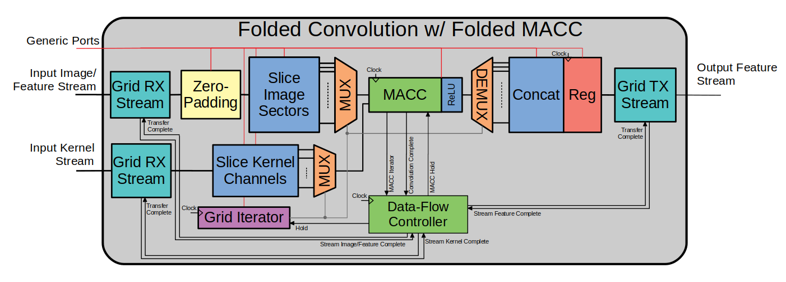

   Figure: Simplified diagram for the "fully-folded" version of the convolution module.

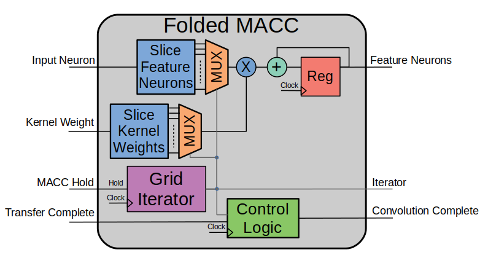

   Figure: Diagram of the MACC operation folded over multiple clock cycles.

.. code-block:: VHDL

  -- folded_conv_v2.vhd
  
  library IEEE;
  use IEEE.STD_LOGIC_1164.ALL;
  use IEEE.NUMERIC_STD.ALL;
  use IEEE.math_real.all;
  library xil_defaultlib;
  use xil_defaultlib.mypackage.ALL;
  
  entity folded_conv_v2 is
    Generic (
      IMAGE_SIZE      : positive;     -- I
      KERNEL_SIZE     : positive;     -- K
      CHANNELS_IN     : positive;     -- Ci
      GRADIENT_BITS   : positive;     -- B
      CHANNELS_OUT    : positive;     -- Co
      STRIDE_STEPS    : positive;     -- S
      ZERO_PADDING    : natural;      -- P
      RELU_ACTIVATION : boolean
      -- Feature Size: F = (I+2*P-K)/S + 1
      -- Clock Cycles: C = Ci*Co*F**2
    );
    Port (
      Aclk           : in std_logic;
      Aresetn        : in std_logic;
      Image_Stream   : in std_logic_vector(GRADIENT_BITS-1 downto 0);
      Image_Valid    : in boolean;
      Image_Ready    : out boolean;
      Kernel_Stream  : in std_logic_vector(GRADIENT_BITS-1 downto 0);
      Kernel_Valid   : in boolean;
      Kernel_Ready   : out boolean;
      Feature_Stream : out std_logic_vector(GRADIENT_BITS-1 downto 0);
      Feature_Valid  : out boolean;
      Feature_Ready  : in boolean
    );
  end folded_conv_v2;
  
  architecture Behavioral of folded_conv_v2 is
  
    -- Prevents overflow during summation (subtract one because signed)
    constant BITS4SUM : integer := integer(ceil(log2(real(KERNEL_SIZE**2)))) - 1;
  
    signal Input_Image : GridType(
      1 to IMAGE_SIZE,
      1 to IMAGE_SIZE,
      1 to CHANNELS_IN
      ) (GRADIENT_BITS - 1 downto 0);
  
    signal Conv_Image : GridType(
      1 to IMAGE_SIZE,
      1 to IMAGE_SIZE,
      1 to CHANNELS_IN
      ) (GRADIENT_BITS - 1 downto 0);
  
    signal Input_Kernel : GridType(
      1 to KERNEL_SIZE,
      1 to KERNEL_SIZE,
      1 to CHANNELS_IN * CHANNELS_OUT
      ) (GRADIENT_BITS - 1 downto 0);
  
    signal Conv_Kernel : GridType(
      1 to KERNEL_SIZE,
      1 to KERNEL_SIZE,
      1 to CHANNELS_IN * CHANNELS_OUT
      ) (GRADIENT_BITS - 1 downto 0);
  
    signal Conv_Feature : GridType(
      1 to (IMAGE_SIZE + 2 * ZERO_PADDING - KERNEL_SIZE) / STRIDE_STEPS + 1,
      1 to (IMAGE_SIZE + 2 * ZERO_PADDING - KERNEL_SIZE) / STRIDE_STEPS + 1,
      1 to CHANNELS_OUT
      ) (GRADIENT_BITS - 1 downto 0);
  
    signal Output_Feature : GridType(
      1 to (IMAGE_SIZE + 2 * ZERO_PADDING - KERNEL_SIZE) / STRIDE_STEPS + 1,
      1 to (IMAGE_SIZE + 2 * ZERO_PADDING - KERNEL_SIZE) / STRIDE_STEPS + 1,
      1 to CHANNELS_OUT
      ) (GRADIENT_BITS - 1 downto 0);
    
    -- MAC iterator signals
    signal macc_hold : boolean;
    signal macc_row  : integer range Conv_Kernel'range(1);
    signal macc_col  : integer range Conv_Kernel'range(2);
    signal macc_chn  : integer range Conv_Kernel'range(3);
  
    -- Convolution iterator signals
    signal conv_hold : boolean;
    signal conv_row : integer range Conv_Feature'range(1);
    signal conv_col : integer range Conv_Feature'range(2);
    signal conv_chn : integer range Conv_Feature'range(3);
  
    -- Data-flow control signals
    signal image_complete       : boolean;
    signal kernel_complete      : boolean;
    signal conv_complete        : boolean;
    signal feature_complete     : boolean;
    signal transfer_complete    : boolean;
  
  begin
  
    --------------- Data-flow controller -------------
    process_dataflow_control : process(Aclk, Aresetn)
    begin
      if Aresetn = '0' then
        transfer_complete <= FALSE;
        Conv_Kernel     <= (others => (others => (others => (others => '0'))));
        Conv_Image      <= (others => (others => (others => (others => '0'))));
        Output_Feature  <= (others => (others => (others => (others => '0'))));
      elsif rising_edge(Aclk) then
        if transfer_complete then
          transfer_complete <= FALSE;
        elsif image_complete and kernel_complete and conv_complete and feature_complete then
          Conv_Kernel     <= Input_Kernel;
          Conv_Image      <= Input_Image;
          Output_Feature  <= Conv_Feature;
          transfer_complete <= TRUE;
        end if;
      end if;
    end process;
    --------------------------------------------------
  
    ---------------- RX in image grid ----------------
    grid_rx_image : stream_grid_rx
      generic map(
        GRID_SIZE       => Input_Image'high(1),
        CHANNEL_COUNT   => Input_Image'high(3),
        GRADIENT_BITS   => GRADIENT_BITS
        )
      port map(
        Aclk                => Aclk,
        Aresetn             => Aresetn,
        Stream_Data         => Image_Stream,
        Stream_Valid        => Image_Valid,
        Stream_Ready        => Image_Ready,
        Grid_Data           => Input_Image,
        Transfer_Complete   => transfer_complete,
        Stream_Complete     => image_complete
        );
    --------------------------------------------------
  
    ---------------- RX in kernel grid ----------------
    grid_rx_kernel : stream_grid_rx
      generic map(
        GRID_SIZE       => Input_Kernel'high(1),
        CHANNEL_COUNT   => Input_Kernel'high(3),
        GRADIENT_BITS   => GRADIENT_BITS
        )
      port map(
        Aclk                => Aclk,
        Aresetn             => Aresetn,
        Stream_Data         => Kernel_Stream,
        Stream_Valid        => Kernel_Valid,
        Stream_Ready        => Kernel_Ready,
        Grid_Data           => Input_Kernel,
        Transfer_Complete   => transfer_complete,
        Stream_Complete     => kernel_complete
        );
    --------------------------------------------------
  
    --------------- Compute convolution --------------
    convolution_process : process_conv
      generic map (
        IMAGE_SIZE      => IMAGE_SIZE,
        KERNEL_SIZE     => KERNEL_SIZE,
        CHANNELS_IN     => CHANNELS_IN,
        GRADIENT_BITS   => GRADIENT_BITS,
        CHANNELS_OUT    => CHANNELS_OUT,
        STRIDE_STEPS    => STRIDE_STEPS,
        ZERO_PADDING    => ZERO_PADDING,
        RELU_ACTIVATION => RELU_ACTIVATION
        )
      port map (
        Aclk                => Aclk,
        Aresetn             => Aresetn,
        Conv_Image          => Conv_Image,
        Conv_Kernel         => Conv_Kernel,
        Conv_Feature        => Conv_Feature,
        conv_complete       => conv_complete,
        macc_hold           => macc_hold,
        macc_row            => macc_row,
        macc_col            => macc_col,
        macc_chn            => macc_chn,
        conv_hold           => conv_hold,
        conv_row            => conv_row,
        conv_col            => conv_col,
        conv_chn            => conv_chn,
        transfer_complete   => transfer_complete
        );
  
    -- MACC folding iterator state machine
    iterator_macc_folding : grid_iterator
      generic map (
        GRID_SIZE       => Conv_Kernel'high(1),
        CHANNEL_COUNT   => CHANNELS_IN
        )
      port map (
        Aclk    => Aclk,
        Aresetn => Aresetn,
        hold    => macc_hold,
        row     => macc_row,
        column  => macc_col,
        channel => macc_chn
        );
    macc_hold <= (conv_complete and (not transfer_complete))
              or ((macc_row = Conv_Kernel'high(1)) 
              and (macc_col = Conv_Kernel'high(2)) 
              and (macc_chn = CHANNELS_IN)
              and (conv_row = Conv_Feature'high(1)) 
              and (conv_col = Conv_Feature'high(2)) 
              and (conv_chn = Conv_Feature'high(3)));
  
    -- Convolution folding iterator state machine
    iterator_conv_folding : grid_iterator
      generic map (
        GRID_SIZE       => Conv_Feature'high(1),
        CHANNEL_COUNT   => Conv_Feature'high(3)
        )
      port map (
        Aclk    => Aclk,
        Aresetn => Aresetn,
        hold    => conv_hold,
        row     => conv_row,
        column  => conv_col,
        channel => conv_chn
        );
    conv_hold <= (not (
      (macc_row = Conv_Kernel'high(1)) and 
      (macc_col = Conv_Kernel'high(2)) and
      (macc_chn = CHANNELS_IN))) or conv_complete;
    --------------------------------------------------
  
    -------------- TX out feature grid ---------------
    grid_tx_feature : stream_grid_tx
      generic map(
        GRID_SIZE       => Output_Feature'high(1),
        CHANNEL_COUNT   => Output_Feature'high(3),
        GRADIENT_BITS   => GRADIENT_BITS
        )
      port map(
        Aclk                => Aclk,
        Aresetn             => Aresetn,
        Stream_Data         => Feature_Stream,
        Stream_Valid        => Feature_Valid,
        Stream_Ready        => Feature_Ready,
        Grid_Data           => Output_Feature,
        Transfer_Complete   => transfer_complete,
        Stream_Complete     => feature_complete
        );
    --------------------------------------------------
  
  end Behavioral;

Simulation:

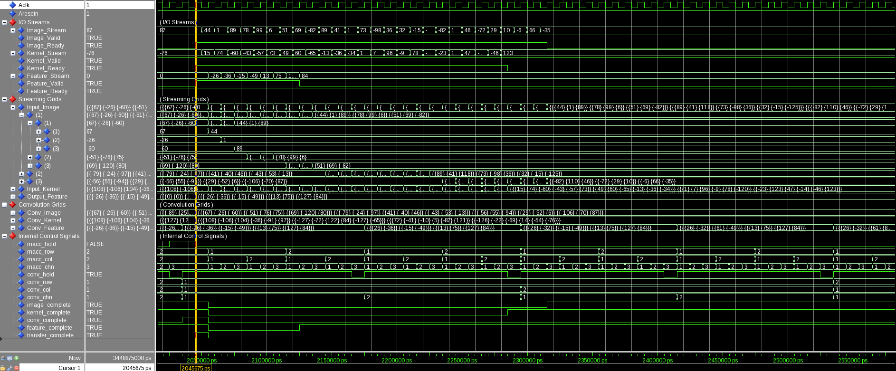

   Figure: Input Stream

**Testbench Simulation and Verification:**

.. code-block:: python

  ----------------------------------------
  Input Size:             3 x 3 x 3
  Kernel Size:            2 x 2 x 3 x 2
  Output Feature Size:    2 x 2 x 2
  Resolution:             8 - bit
  Stride Steps:           1
  Zero Padding:           0
  ReLU Activation:        0
  Number of Batches:      10
  ----------------------------------------
  Check Failed. 1 out of 80 data items do not match.
  ----------------------------------------

**2nd Simulation and Verification**

.. code-block:: python

  ----------------------------------------
  Input Size:             24 x 24 x 3
  Kernel Size:            8 x 8 x 3 x 6
  Output Feature Size:    11 x 11 x 6
  Resolution:             8 - bit
  Stride Steps:           2
  Zero Padding:           2
  ReLU Activation:        0
  Number of Batches:      5
  ----------------------------------------
  Check Passed. All 3630 data items match.
  ----------------------------------------

Conclusion and Direction of Future Work
=======================================

The above designs are relatively simple and do not provide an optimized implementation. The next design for the convolution block would have been to fold the MACC operation but keep the kernel iterations unrolled and see how this affects timing and utilization. Taking advantage of the binarized techniques provided from [FINN] would also have been a good exercise. Synthesis and implementation tools do some optimization but there are additional techniques that could be used to guide the tool towards a more efficient implementation. The parallelized summations is one example of this that I did not get a chance to finish.

Additionally, I was not able to get my designs running and tested on actual hardware. This next step requires a significant amount of effort to set up high speed interfaces, DMA engines, and other data-flow units required for a complete model implementation. 

Other desinigs that were developed but not discussed in the report includes a pooling blocks, stand-alone ReLU block, fully-connected block, as well as modules for interfacing/wrapping VHDL-2008 designs to become supported in the Vivado IP block desings. These in addition to test-bench code will be included in the report submission zip file.

Appendix
========

Python/PyTorch Convolution Verification Script
----------------------------------------------

.. code-block:: python

  # verify_convolution_sim.py

  import torch
  from torch import conv2d
  import math
  
  file_input  = open('data/sim01/input_data.txt', 'r')
  file_kernel = open('data/sim01/kernel_data.txt', 'r')
  file_output = open('data/sim01/output_data.txt', 'r')
  
  input_data  = torch.tensor([int(val) for val in file_input.readlines()])
  kernel_data = torch.tensor([int(val) for val in file_kernel.readlines()])
  output_data = torch.tensor([int(val) for val in file_output.readlines()])
  
  # Load convolution parameters stored in input data file
  image_size      = int(input_data[0])
  channels_in     = int(input_data[2])
  kernel_size     = int(input_data[1])
  gradient_bits   = int(input_data[3])
  channels_out    = int(input_data[4])
  stride_steps    = int(input_data[5])
  zero_padding    = int(input_data[6])
  relu_activation = int(input_data[7])
  
  feature_size = int((image_size + 2 * zero_padding - kernel_size) / stride_steps + 1)
  bits4sum = math.ceil(math.log2(kernel_size**2) - 1)
  conv_batches = int(input_data.size()[0] / (channels_in * image_size**2))
  
  print('----------------------------------------')
  print('Input Size:            ',image_size,'x',image_size,'x',channels_in)
  print('Kernel Size:           ',kernel_size,'x',kernel_size,'x',channels_in,'x',channels_out)
  print('Output Feature Size:   ',feature_size,'x',feature_size,'x',channels_out)
  print('Resolution:            ',gradient_bits,'- bit')
  print('Stride Steps:          ',stride_steps)
  print('Zero Padding:          ',zero_padding)
  print('ReLU Activation:       ',relu_activation)
  print('Number of Batches:     ',conv_batches)
  
  # Initialize multi-dimensional arrays
  input_array  = torch.zeros(conv_batches, 1,            channels_in,  image_size,  image_size)
  kernel_array = torch.zeros(conv_batches, channels_out, channels_in,  kernel_size, kernel_size)
  output_array = torch.zeros(conv_batches, channels_out, feature_size, feature_size)
  output_check = torch.zeros(conv_batches, channels_out, feature_size, feature_size)
  
  idx_i = 8
  idx_k = 0
  idx_o = 0
  
  # Cycle through all batches
  for batch in range(conv_batches):
    # Store input data in multi-dimensional array formatted for PyTorch conv2d
    for row in range(image_size):
      for col in range(image_size):
        for chn in range(channels_in):
          input_array[batch, 0, chn, row, col] = input_data[idx_i]
          idx_i += 1
    # Store kernel weights in multi-dimensional array formatted for PyTorch conv2d
    for row in range(kernel_size):
      for col in range(kernel_size):
        for chn_o in range(channels_out):
          for chn_i in range(channels_in):
            kernel_array[batch, chn_o, chn_i, row, col] = kernel_data[idx_k]
            idx_k += 1
    # Store output data in multi-dimensional array formatted for PyTorch conv2d
    for row in range(feature_size):
      for col in range(feature_size):
        for chn in range(channels_out):
          output_array[batch, chn, row, col] = output_data[idx_o]
          idx_o += 1
    # Use PyTorch convolution function to generate expected results
    conv2d_data = conv2d(input_array[batch], kernel_array[batch], padding=zero_padding, stride=stride_steps)
    # Scale down results to designated bit-width integers
    output_check[batch] = (conv2d_data / 2**(gradient_bits + bits4sum)).floor()
  
  # Check whether VHDL testbench output matches PyTorch expected output
  num_correct = (output_check == output_array).sum()
  num_total = torch.tensor(output_check.size()).prod()
  print('----------------------------------------')
  if num_correct == num_total:
    print('Check Passed. All', int(num_total), 'data items match.')
  else:
    print('Check Failed.', int(num_total-num_correct), 'out of', int(num_total), 'data items do not match.')
  print('----------------------------------------')

Custom VHDL Package
-------------------

.. code-block:: VHDL
  
  -- mypackage.vhd
  
  library IEEE;
  use IEEE.STD_LOGIC_1164.ALL;
  use IEEE.NUMERIC_STD.ALL;
  use IEEE.math_real.uniform;
  use IEEE.math_real.floor;
  
  package mypackage is
  
      type GridType is array(natural range <>, natural range <>, natural range <>) of signed;
  
      component convolution
          Generic(
            IMAGE_SIZE      : positive;
            KERNEL_SIZE     : positive;
            CHANNELS_IN     : positive;
            GRADIENT_BITS   : positive;
            CHANNELS_OUT    : positive;
            STRIDE_STEPS    : positive;
            ZERO_PADDING    : natural;
            RELU_ACTIVATION : boolean
          );
          Port ( 
              Aclk            : in std_logic;
              Aresetn         : in std_logic;
              Input_Image     : in GridType(  
                  1 to IMAGE_SIZE,
                  1 to IMAGE_SIZE,
                  1 to CHANNELS_IN
                  ) (GRADIENT_BITS - 1 downto 0);
              Kernel_Weights  : in GridType(  
                  1 to KERNEL_SIZE,
                  1 to KERNEL_SIZE,
                  1 to CHANNELS_IN * CHANNELS_OUT
                  ) (GRADIENT_BITS - 1 downto 0);
              Output_Feature  : out GridType( 
                  1 to (IMAGE_SIZE + 2 * ZERO_PADDING - KERNEL_SIZE) / STRIDE_STEPS + 1,
                  1 to (IMAGE_SIZE + 2 * ZERO_PADDING - KERNEL_SIZE) / STRIDE_STEPS + 1,
                  1 to CHANNELS_OUT
                  ) (GRADIENT_BITS - 1 downto 0)
          );
      end component;
  
      component folded_conv_v1
          Generic(
            IMAGE_SIZE      : positive;
            KERNEL_SIZE     : positive;
            CHANNELS_IN     : positive;
            GRADIENT_BITS   : positive;
            CHANNELS_OUT    : positive;
            STRIDE_STEPS    : positive;
            ZERO_PADDING    : natural;
            RELU_ACTIVATION : boolean
          );
          Port (  
            Aclk            : in std_logic;
            Aresetn         : in std_logic;
            Input_Image     : in GridType(  
              1 to IMAGE_SIZE,
              1 to IMAGE_SIZE,
              1 to CHANNELS_IN
              ) (GRADIENT_BITS - 1 downto 0);
            Kernel_Weights    : in GridType(  
              1 to KERNEL_SIZE,
              1 to KERNEL_SIZE,
              1 to CHANNELS_IN * CHANNELS_OUT
              ) (GRADIENT_BITS - 1 downto 0);
            Output_Feature  : out GridType( 
              1 to (IMAGE_SIZE + 2 * ZERO_PADDING - KERNEL_SIZE) / STRIDE_STEPS + 1,
              1 to (IMAGE_SIZE + 2 * ZERO_PADDING - KERNEL_SIZE) / STRIDE_STEPS + 1,
              1 to CHANNELS_OUT
              ) (GRADIENT_BITS - 1 downto 0);
            conv_complete   : out boolean
          );
      end component;
  
      component process_conv
          Generic (
            IMAGE_SIZE      : positive;
            KERNEL_SIZE     : positive;
            CHANNELS_IN     : positive;
            GRADIENT_BITS   : positive;
            CHANNELS_OUT    : positive;
            STRIDE_STEPS    : positive;
            ZERO_PADDING    : natural; 
            RELU_ACTIVATION : boolean
            );
          Port (
            Aclk    : in std_logic;
            Aresetn : in std_logic;
            Conv_Image : in GridType(
              1 to IMAGE_SIZE,
              1 to IMAGE_SIZE,
              1 to CHANNELS_IN
              ) (GRADIENT_BITS - 1 downto 0);
            Conv_Kernel : in GridType(
              1 to KERNEL_SIZE,
              1 to KERNEL_SIZE,
              1 to CHANNELS_IN * CHANNELS_OUT
              ) (GRADIENT_BITS - 1 downto 0);
            Conv_Feature : out GridType(
              1 to (IMAGE_SIZE + 2 * ZERO_PADDING - KERNEL_SIZE) / STRIDE_STEPS + 1,
              1 to (IMAGE_SIZE + 2 * ZERO_PADDING - KERNEL_SIZE) / STRIDE_STEPS + 1,
              1 to CHANNELS_OUT
              ) (GRADIENT_BITS - 1 downto 0);
            macc_hold           : in boolean;
            macc_row            : in integer range 1 to KERNEL_SIZE;
            macc_col            : in integer range 1 to KERNEL_SIZE;
            macc_chn            : in integer range 1 to CHANNELS_IN;
            conv_hold           : in boolean;
            conv_row            : in integer range 1 to 
              (IMAGE_SIZE + 2 * ZERO_PADDING - KERNEL_SIZE) / STRIDE_STEPS + 1;
            conv_col            : in integer range 1 to 
              (IMAGE_SIZE + 2 * ZERO_PADDING - KERNEL_SIZE) / STRIDE_STEPS + 1;
            conv_chn            : in integer range 1 to CHANNELS_OUT;
            transfer_complete   : in boolean;
            conv_complete       : out boolean
            );
      end component;
  
      component relu
          Generic(
              FEATURE_SIZE    : natural := 6;
              CHANNEL_COUNT   : natural := 3;
              GRADIENT_BITS   : natural := 8
          );
          Port (
              Aclk            : in std_logic;
              Aresetn         : in std_logic;
              Input_Feature   : in GridType(
                  1 to FEATURE_SIZE,
                  1 to FEATURE_SIZE,
                  1 to CHANNEL_COUNT
                  ) (GRADIENT_BITS - 1 downto 0);
              Output_Feature  : out GridType(
                  1 to FEATURE_SIZE,
                  1 to FEATURE_SIZE,
                  1 to CHANNEL_COUNT
                  ) (GRADIENT_BITS - 1 downto 0)
          );
      end component;
  
      component pooling
          Generic(
              FEATURE_SIZE    : natural := 6;
              CHANNEL_COUNT   : natural := 3;
              GRADIENT_BITS   : natural := 8;
              POOL_SIZE       : natural := 2
          );
          Port (  
              Aclk            : in std_logic;
              Aresetn         : in std_logic;
              Feature_In      : in GridType(  
                  1 to FEATURE_SIZE,
                  1 to FEATURE_SIZE,
                  1 to CHANNEL_COUNT
                  ) (GRADIENT_BITS - 1 downto 0);
              Feature_Out     : out GridType( 
                  1 to FEATURE_SIZE/POOL_SIZE,
                  1 to FEATURE_SIZE/POOL_SIZE,
                  1 to CHANNEL_COUNT
                  ) (GRADIENT_BITS - 1 downto 0)
          );
      end component;
  
      component interface_conv
          Generic(
            IMAGE_SIZE      : positive;
            KERNEL_SIZE     : positive;
            CHANNELS_IN     : positive;
            GRADIENT_BITS   : positive;
            CHANNELS_OUT    : positive;
            STRIDE_STEPS    : positive;
            ZERO_PADDING    : natural;
            RELU_ACTIVATION : boolean;
            FOLDED_CONV     : boolean
          );
          Port (  
            Aclk            : in std_logic;
            Aresetn         : in std_logic;
            Input_Image     : in std_logic_vector(
                GRADIENT_BITS * CHANNELS_IN * IMAGE_SIZE**2 - 1 downto 0);
            Kernel_Weights  : in std_logic_vector(
                GRADIENT_BITS * CHANNELS_IN * CHANNELS_OUT * KERNEL_SIZE**2 - 1 downto 0);
            Output_Feature  : out std_logic_vector(
                GRADIENT_BITS * CHANNELS_OUT 
                * ((IMAGE_SIZE + 2 * ZERO_PADDING - KERNEL_SIZE) / STRIDE_STEPS + 1)**2 - 1 downto 0);
            conv_complete   : out boolean
          );
      end component;
  
      component interface_relu
          Generic(
              FEATURE_SIZE    : natural := 6;
              CHANNEL_COUNT   : natural := 3;
              GRADIENT_BITS   : natural := 8
          );
          Port (  
              Aclk            : in std_logic;
              Aresetn         : in std_logic;
              Input_Feature   : in 
                std_logic_vector(GRADIENT_BITS * CHANNEL_COUNT * FEATURE_SIZE**2 - 1 downto 0);
              Output_Feature  : out 
                std_logic_vector(GRADIENT_BITS * CHANNEL_COUNT * FEATURE_SIZE**2 - 1 downto 0)
          );
      end component;
   
      component interface_pool
          Generic(
              FEATURE_SIZE    : natural := 6;
              CHANNEL_COUNT   : natural := 3;
              GRADIENT_BITS   : natural := 8;
              POOL_SIZE       : natural := 2
          );
          Port (
              Aclk        : in std_logic;
              Aresetn     : in std_logic;
              Feature_In  : in 
                std_logic_vector(GRADIENT_BITS * CHANNEL_COUNT * FEATURE_SIZE**2 - 1 downto 0);
              Feature_Out : out 
                std_logic_vector(GRADIENT_BITS * CHANNEL_COUNT * (FEATURE_SIZE / POOL_SIZE)**2 - 1 downto 0)
          );
      end component;
  
      component grid_iterator
          Generic(
              GRID_SIZE       : natural := 8;
              CHANNEL_COUNT   : natural := 3
          );
          Port (
              Aclk    : in std_logic;
              Aresetn : in std_logic;
              hold    : in boolean;
              row     : out integer range 1 to GRID_SIZE;
              column  : out integer range 1 to GRID_SIZE;
              channel : out integer range 1 to CHANNEL_COUNT
          );
      end component;
  
      component stream_grid_tx
          Generic (
              GRID_SIZE       : natural := 6;
              CHANNEL_COUNT   : natural := 3;
              GRADIENT_BITS   : natural := 8
          );
          Port (
              Aclk     : in std_logic;
              Aresetn  : in std_logic;
              Stream_Data     : out std_logic_vector(GRADIENT_BITS - 1 downto 0);
              Stream_Valid    : out boolean;
              Stream_Ready    : in boolean;
              Grid_Data : in GridType(
                  1 to GRID_SIZE,
                  1 to GRID_SIZE,
                  1 to CHANNEL_COUNT
                  ) (GRADIENT_BITS - 1 downto 0);
              Transfer_Complete   : in boolean;
              Stream_Complete     : out boolean
          );
      end component;
  
      component stream_grid_rx
          Generic (
              GRID_SIZE       : natural := 6;
              CHANNEL_COUNT   : natural := 3;
              GRADIENT_BITS   : natural := 8
          );
          Port (
              Aclk     : in std_logic;
              Aresetn  : in std_logic;
              Stream_Data     : in std_logic_vector(GRADIENT_BITS - 1 downto 0);
              Stream_Valid    : in boolean;
              Stream_Ready    : out boolean;
              Grid_Data : out GridType(
                  1 to GRID_SIZE,
                  1 to GRID_SIZE,
                  1 to CHANNEL_COUNT
                  ) (GRADIENT_BITS - 1 downto 0);
              Transfer_Complete   : in boolean;
              Stream_Complete     : out boolean
          );
      end component;
  
      -- Procedures
      procedure random_grid(
          urange, bitwidth : in positive; 
          variable s1, s2 : inout positive; 
          signal input_grid : inout GridType);
  
  end package mypackage;
  
  
  package body mypackage is
  
      procedure random_grid(
          urange, bitwidth : in positive; 
          variable s1, s2 : inout positive;
          signal input_grid : inout GridType) is
          variable x : real;
      begin
          for i in input_grid'range(1) loop
              for j in input_grid'range(2) loop
                  for k in input_grid'range(3) loop
                      uniform(s1, s2, x);
                      input_grid(i,j,k) 
                        <= to_signed(integer(floor((x - 0.5) * real(urange))), bitwidth);
                  end loop;
              end loop;
          end loop;
      end random_grid;
  
  end package body mypackage;

Citations
=========

1. Umuroglu, Yaman et al. “FINN.” Proceedings of the 2017 ACM/SIGDA International Symposium on Field-Programmable Gate Arrays - FPGA  ’17 (2017): n. pag. Crossref. Web.

2. Stylianos I. Venieris, Alexandros Kouris and Christos-Savvas Bouganis. 2018. Toolflows for Mapping Convolutional Neural Networks on FPGAs: A Survey and Future Directions. ACM Comput. Surv. 0, 0, Article 0
(March 2018), 36 pages.

3. Kaiyuan Guo, Shulin Zeng, Jincheng Yu, Yu Wang and Huazhong Yang. 2017. [DL] A Survey of FPGA-Based
Neural Network Inference Accelerator. ACM Trans. Recon€g. Technol. Syst. 9, 4, Article 11 (December 2017), 26 pages.

4. Kamel Abdelouahab and Maxime Pelcat and Jocelyn Serot and Cedric Bourrasset and Jean-Charles Quinton and François Berry "Hardware Automated Dataflow Deployment of CNNs" (2017) arXiv.

5. H. Sharma et al., "From high-level deep neural models to FPGAs," 2016 49th Annual IEEE/ACM International Symposium on Microarchitecture (MICRO), Taipei, 2016, pp. 1-12.
